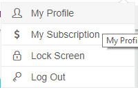
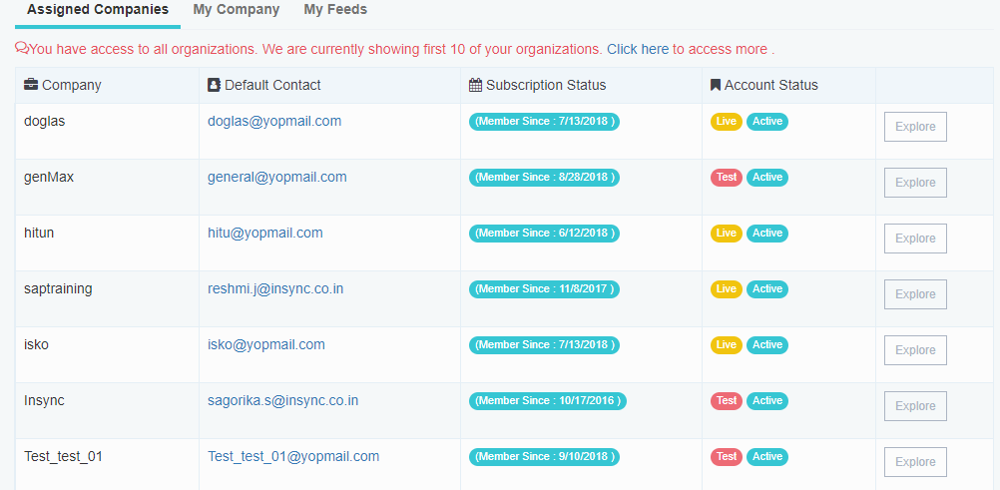
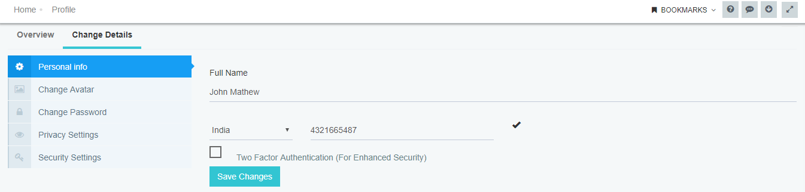
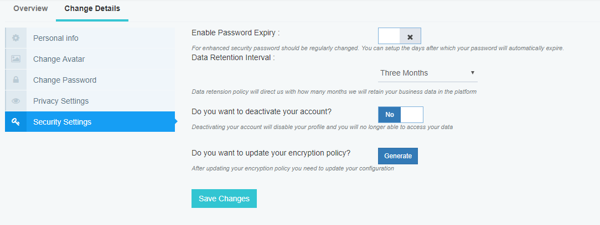
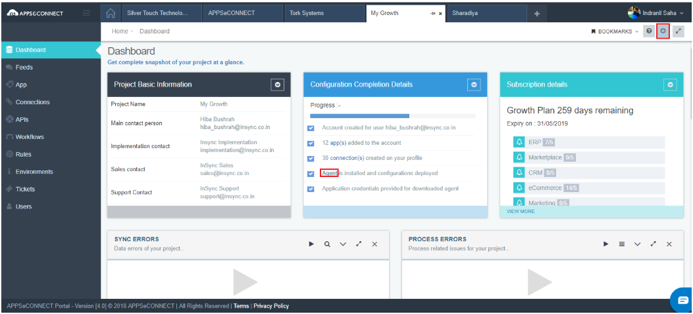
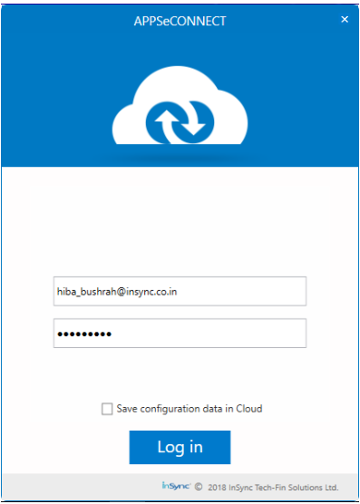
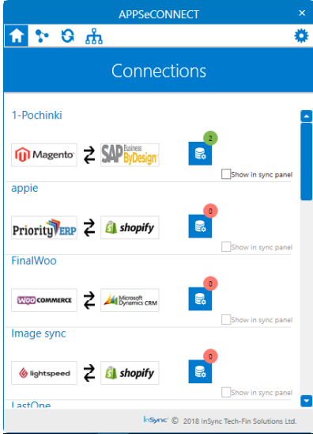
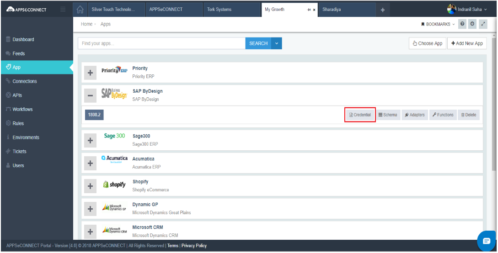
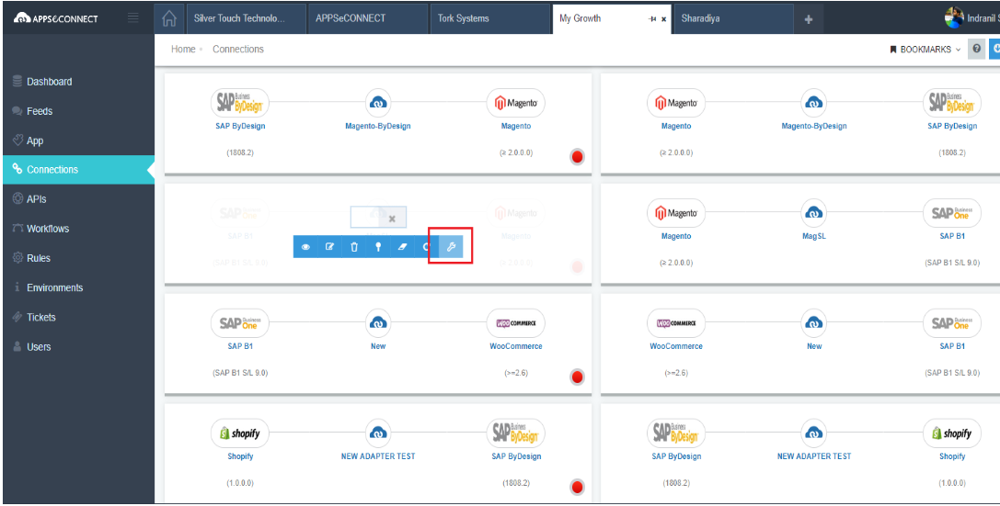
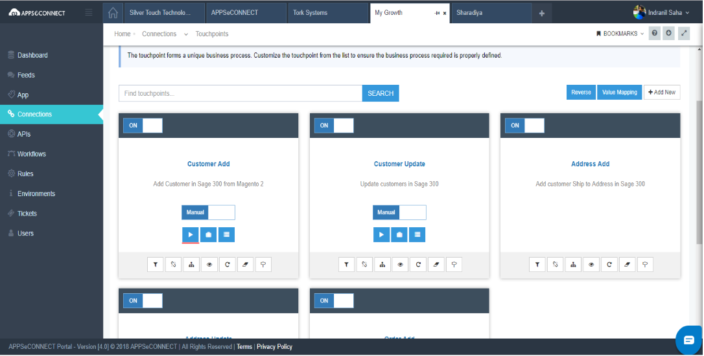

# CUSTOMER PROFILE INFORMATION

This section enables you to quickly access your profile after logging into the application. This is where you will get the overview of your organization including assigned companies under you, your organizxaton details and feeds.

This section also enables you to change details like your personal information, changing avatar, changing password, privacy setting and security setting.

Let us dive in details about every section of customer profile information.

## My Profile

1. Log in to the [APPSeCONNECT portal](appseconnect%20and%20ipaas/home/) with valid credentials.

2. Click on your name, and you can view `My Profile` tab. 

Here you will be able to edit your profile details. Here You will see two tabs - *Overview & Change Details page*.

In this page, you can view your brief detail like your  name, your registered e-mail, your role, phone number and IP address. To know more about Role Management, **click here**.

In the **Summary section**, the count of projects you handle/under organization is shown. You can also see your expired project counts and trials according to your Role and access level, you can see the companies.

**Assigned Companies** will be shown on User Role basis. In **My Company section**, only your company details will be there.

**My Feeds** section is for seeing your recent activities.

By clicking Projects, Workflows, you will be redirected to that particular pages respectively.

**If you click on *Change Details* tab, you can edit all details**.

In the Personal Info tab, you can edit your name, mobile number.

Click  **Change Avatar** to change your Profile picture.

Click **Change Password** to change the password and set your new password.

The **Privacy Setting section** allows you to agree/disagree with the privacy policy. Basic privacy policy includes - Subscribing to Email Notifications & Acceptance of Terms & Condition.

The **Security Setting** enables you to handle all the security related settings like password expiry time set, account decativation and updating encryption policy. 

**CONFIGURING APPSeCONNECT**

**Login to APPSeCONNECT - View Home Page to get the details. Click here**

**Configuring Environment - Agent download / Cloud agent configuration**

APPSeCONNECT On-Premise Agent is a hybrid tool that sits on your own server and is configured on cloud and does the actual data synchronization with the help of other concerned adapters while the Cloud agent is a similar tool that performs the same function as the on-premise agent but is present on cloud itself. No server is required to configure or sync using the cloud agent.

Environment setup of the on-premise agent:

 1. Login to the portal and from the Dashboard section download the Agent from the Downloads section as shown below.

   

 2. Run the setup folder to install the Agent in the system.
 3. Open the installed Agent on your machine.

4. Login to the agent with your portal credentials.

   

5.   There are four icons as shown below:
The home icon shows the connections in the project.
The apps configuration icon (next to the home icon) shows the applications used for the connections which need to be configured for successful sync.

The sync panel displays the connections deployed successfully for sync. It is visible after you have checked the Show in sync panel checkbox in the Connections page.

The last one is the Workflow option that displays the configured workflows in the project.

  

**Environment setup of the Cloud agent**:

Pre-requisites:
* The project should be cloud supported.

* The two apps between which data has to be synced should be cloud supported. 

* The connection between the two applications should be cloud supported.

1. Login to the portal and under the apps section provide the respective app credential data (similar to the configuration of the app in the on-premise Agent).

2.  Go to the Connections page and assign the app's credential to the connection by choosing the configuration setup option as shown below.

3. Click on the View the Connection icon and navigate to the touchpoints page.

4. Click on the play button to run the sync process.

**Configuring Apps**