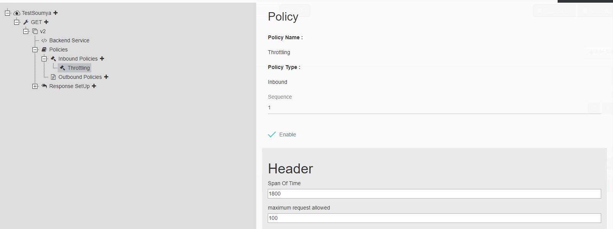

---
title: "Quota for a Key policy"
toc: true
tag: developers
category: "API-Management"
author: "Abhishek Sur"
menus: 
    policies:
        icon: fa fa-cogs
        title: "Quota-Per-Key-Policy" 
---
The **Rate-limit quota** policy prevents an API usage spikes on per user basis, such that if the same API is 
getting somehow spammed, the policy will automatically detect it and updae the response accordingly. The 
API rate limit can be set up by the developer for a specified time period and when the policy is
triggered for a specific call, the caller will receive `429 Too Many Requests` as response status code.

**ProTip:** Policy can only be used once per API configuration.

### Policy Statement

Each policy requires certain configuration, which will allow to configure the policy for a particular API endpoint. 
Below are the list of configurations required for this policy.

The rules and setup needs to be made accordingly. 

|Name|Description|Is Mandatory|Default Value|
|-----------|--------------------|----------|----------|
|Span of time|Represent the amount of timespan required after which the requests from that particular user will automatically throttle|Yes|Infinity|
|Max Requests|Number of requests to be allowed during the specified timespan|Yes|100|

### Policy Usage

The policy can be applied only at `inbound` section.

### Scope

Currently the policy can be applied at API Version Scope only.

