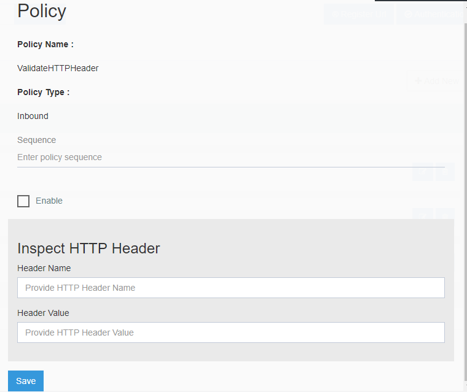

**Validate HTTP Header** policy inspects each HTTP Request whether the HTTP Request contains a particular 
Request Header or a specified Header value matches with some predefined value. If the incoming request
does not match with the criteria set by the policy configuration then the request is immediately 
rejected.

### Policy Statement

Each policy requires certain configuration, which will allow to configure the policy for a particular API endpoint. 
Below are the list of configurations required for this policy.

The rules and setup needs to be made accordingly. 

|Name|Description|Is Mandatory
|-----------|--------------------|----------
|Header Name|Indicates the Header Name to inspect in each HTTP Request whether the header exists or not|Yes|
|Header Value|Header value to be checked for the specified Header Name|No

### Policy Usage

The policy can be applied only at `inbound` section.

### Scope

Currently the policy can be applied at API Version Scope only.
