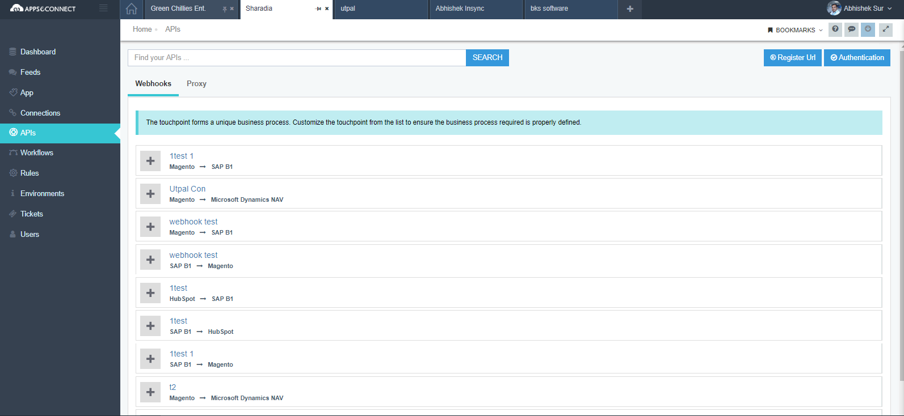

**Webhooks** are custom callbacks from an application which is generated by the caller and data is pushed to all of the subscribers.Webooks are based on **Publisher-Subscriber** model,where
the publisher will publish something and subscribers thats are only registered for the publisher will listen to it. 

A Webhook is simply an event notification where the 
sender will send real time data typically via `HTTP POST` to other applications which have registered for that event.
Data that are transferred are typically in `XML` or in `JSON` or in Form-Encoded format which is to be decided by the provider.

With **APPSeCONECT**, you can create webhook endpoint which are basically handlers for a WebHook that can be used to fetch real time data from an application that has support of webhook 
and that data can then be synced to other apps via APPSeCONNECT Integration Platform in real time using real-time API.

Follow these steps to create a Webhook API with **APPSeCONNECT**

## Prerequisites

As per requirement, before you start creating a new Webhook endpoint, you need to make sure you meet all the 
prerequisites. Here are some of them : 

1. [Getting a new account for APPSeCONNECT]()
2. [Configuring your Environments]()
3. [Choosing Apps or Adding Apps]()
4. [Importing schemas and actions of an Application]()
5. [Creating a Connection]()

## Steps to create Webhook Endpoint:

* Go to **API** section from the left side menu.

*  Inside **APIManagementSection** you can see Webhooks and Proxy.By defeault,Webhook section will be
  shown.You can see all your connections listed here.

* If you do not have a registered URL with **APPSeCONNECT** you have to Register a URL for your organization.Here is how to do it.
   Click on Register URL button. Upon clicking you will get a  popup like this.

* Please activate the Cloud hosting enabled. And provide a unique name in Register Url for your organization.For example,XYPrivateLimited.
  So the Base URL for the organization would be `XYPrivateLimited.appseconnectapi.com`.
  
  If you want to create Proxy API stack please provide details like Description,Title,Terms and Conditions and license.
  After this,click on save button and your url would be saved.

  ##### Create A Real Time API :

* 