## Prerequisites for configuring Oauth 1.0 in On Premise Agent
* You need to have a valid credentials to the portal.
* You need create a [REST based Technology Application](/configuring%20appseconnect/configurations/#b-technology-app-creation). 
* [Configure the connector](/accessing%20portal/accessing-portal/) and [create a connection](/getting%20started/configurations-for-integration/#configuring-connector-while-creating-connection) between the two apps. 
* Publish the created connection and update the configuration followed by update adapters in agent.

**Note: You need Exit and Restart the agent after updating the adapters in the 
On-Premise Agent.**

## Process to configure Oauth 1.0 in Rest Adapter - Oauth 1.0
Follow the process given below to configure the OAuth 1.0 in the On-Premise Agent.
1.	You need to open the On-Premise Agent. By default you can view the Apps Configuration Page. 
2.	Beside the chosen app, Click on the Plus (+) symbol. Here Twitter is chosen as it supports Oauth 1.0 authentication.
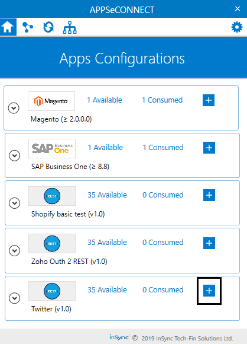      
3.	The REST App configuration window opens. Select the type Oauth 1.0 from drop down of the Authentication Tab.  
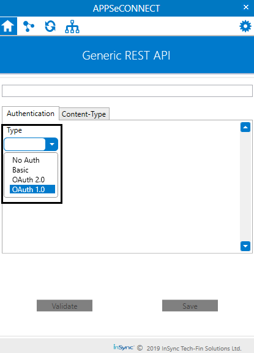    
4.	You can now view the fields for Oauth 1.0 authentication configuration.  
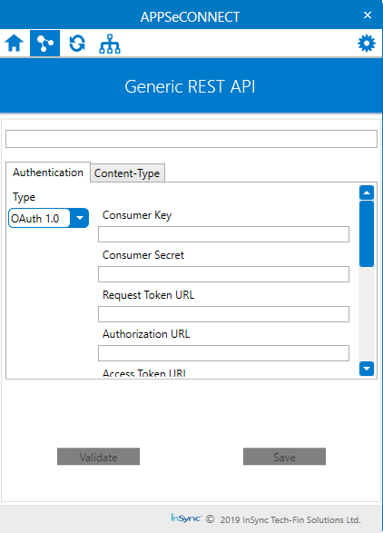  
5.	Provide the field details of the application you are using. The following are the field details that the user needs to provide for validating the Generic REST adapter for OAuth 1.0.
* Base URL - You need to provide the base URL of the application that you are using here.
**Here in Twitter the Base URL can be found by generating a Resource URL in its API Documentation.** 
* Consumer Key - A key to obtain authorization from the user which is generated in the application. 
* Consumer Secret - A secret key that establishes the ownership of the Consumer Key generated by you.
* Request Token URL -  This URL obtains an unauthorized Request Token.
* Authorization URL - This URL obtains the user authorization for Consumer access.
* Access Token URL - The URL used to exchange the User-authorized Request Token for an Access Token
* Call Back URL - This is the secondary URL required for data restoration.
* Client Username - Username of the application you are using.
* Client Password - Password of the application you are using.
* Signature Method - This is a security protocol used by the application you are using. 
* Realm (Optional) - This is an optional field that defines the protection realm of the application.
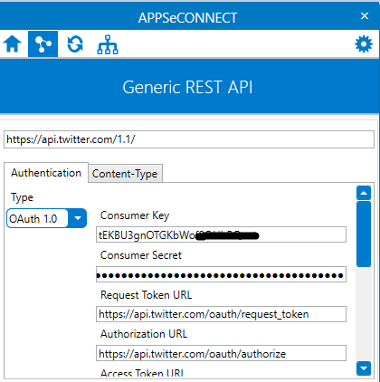  
6.	Click on the Content-Type Tab and select the type of file that the application handles – XML, JSON.
 **Currently REST Adapters handles two file types - XML & JSON**  
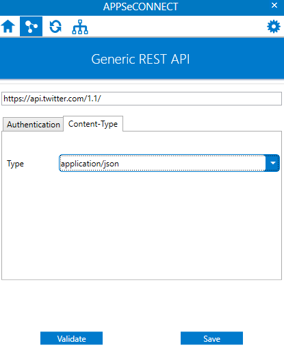  
7.	Navigate to the Authentication tab. Click on Validate button.
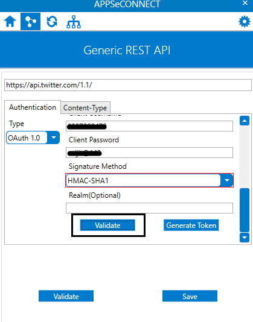  
8.	You will be redirected to the login screen of your application. Provide the `username` and the `password` 
  of your application.   
**Here we have used the application Twitter. Therefore, you can view the twitter 
login page.**    
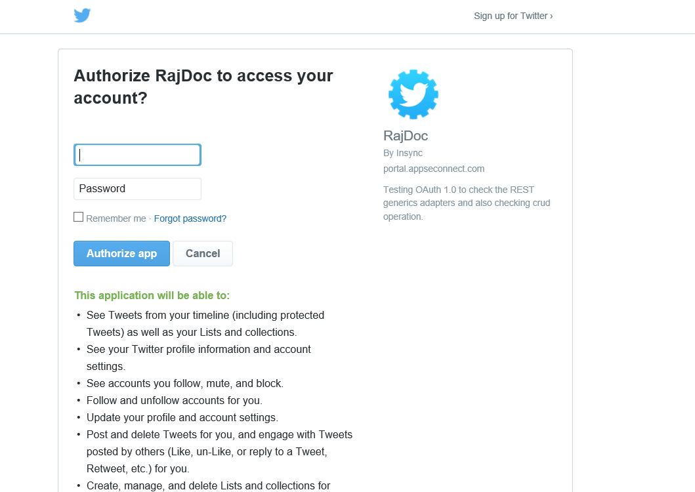  
9.	You will be redirected to the URL you provided as the Call Back URL. 
Navigate to the On-Premise Agent and click on the Generate Token Button.  
**Note: You need to keep the browser open where you were redirected to the Call 
Back URL while generating the token.**    
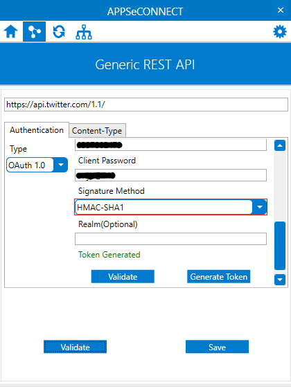  
10.	Click on the validate button after generating the token.    
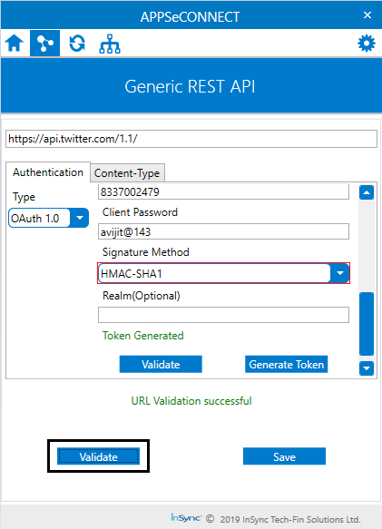   

Following the above given process, you successfully validate the  REST Adapter of Oauth 
1.0 authentication in On Premise Agent.

## Prerequisites for configuring Oauth 1.0 in Cloud Agent
* You need to have a valid credentials to the portal.
* You need create a REST based Technology Application. [Click here](/getting%20started/configurations/#b-technology-app-creation) to know the process of creating a technology application.
* If you are creating your Technology app from Process Flow, [Click Here](/processflow/technology-app-creation-using-processflow/) to get the steps of the same.
* Before proceeding with configuring cloud agent with application credentials, you need to click on the Get Latest Generic Adapter in the Adapters/Extension section of the application.

**Note: 
(a) You need to enable the Cloud Support checkbox while creating the technology app.
(b)If your adapter is Latest, you will not get the option for Get latest Generic Adapter.**

## Process to configure Oauth 1.0 in  Rest Adapter – Cloud Agent

1.	Navigate to the  APPS section in portal and expand the app node by clicking the + button. You can view the option Credential.
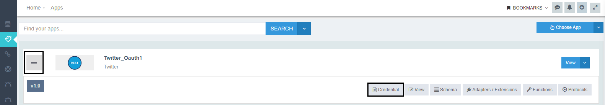
2.	Click the Credential button. You can view the credential page.
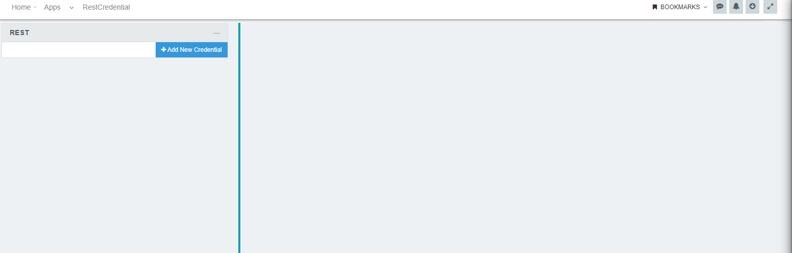
3.	Click on the Add new Credential button.  The credential details page appears. You can view the following fields.
* Credential Name - You need to provide a name to credential for identifying in case of multiple credentials for a single app.
* URL - You need to provide the base URL of the application that you are using here.
* Content Type - You need to select the type of file that the application handles. 
* Authorization type - You need to select the authorization type as Oauth 1.0.
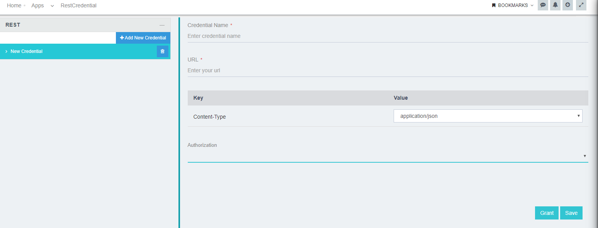

**Note:** If you don't have  a cloud environment created on your organisation, You will be getting this message **`Please create an cloud environment to Grant the credentials`** on clicking the **Add new Credential** button. 
To know more about creating Cloud Environment, [Click Here](/deployment/Environment-Management/#adding-cloud-environment)

4.	Select the authorization type as Oauth 1.0. You get the following fields upon selecting:
* Consumer Key - A key to obtain authorization from the user which is generated in the application. 
* Consumer Secret - A secret key that establishes the ownership of the Consumer Key generated by you.
* Request Token URL -  This URL obtains an unauthorized Request Token.
* Authorization URL - This URL obtains the user authorization for Consumer access.
* Access Token URL - The URL used to exchange the User-authorized Request Token for an Access Token
* Call Back URL - This is the secondary URL required for data restoration.
* Client Username - Username of the application you are using.
* Client Password - Password of the application you are using.
* Signature Method - This is a security protocol used by the application you are using. 
* Realm (Optional) - this is an optional field that defines the protection realm of the application.
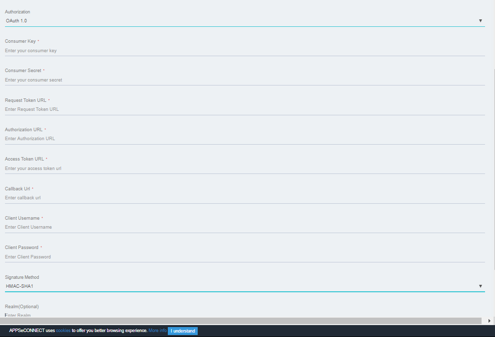
5.	Enter the details for the fields and click on the Grant button. 
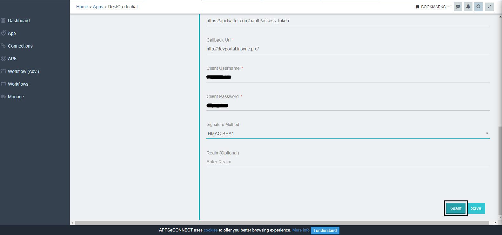
6.	You will be redirected to authorize of your application. Click on the Authorize button.
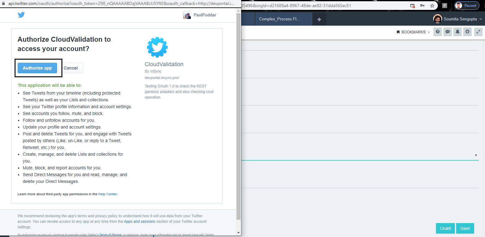
7.	Your application would be validated successfully upon redirecting to the Call Back URL. You will be getting a toaster message at the bottom for successful Token Generation.
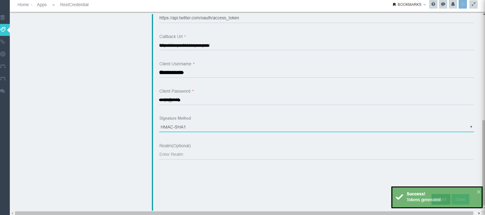
8.	Click  SAVE button.

**Note: Here we have used the application Twitter. Therefore, you can view the twitter authorization page.**