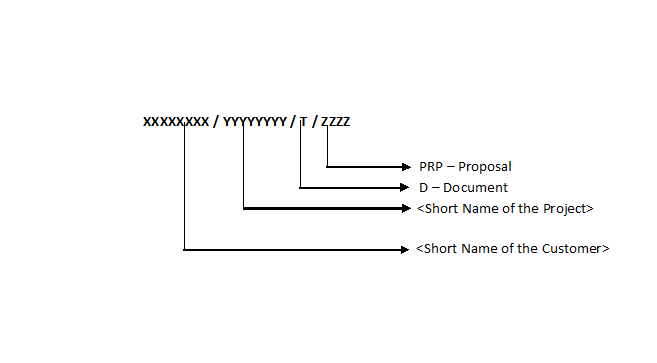

# 1.0 Introduction

## 1.1	Purpose

This documentation standard describes the format for the preparation of various types of documents mentioned herein under scope so that every document produced by any person in the organization is uniformly presentable, complete and consistent across the organization. 

## 1.2	Scope
This standard is applicable to the following four types of documents of Insync :
* Process and Project Documents
* Proposal
* All Customer-related documents and
* Training Material.

The Standards that are mentioned in Section 2.0 are applicable for all types of documents, while specific document type-related standards are mentioned in the Appendix.

# 2.0	Specific Description of the Standards

## 2.1	Document Writing Style

The style of a document is an important consideration to its preparation, because it establishes the effect of the document on the audience. *Clarity is the most important objective*. 

To improve the clarity of the documentation the following points should be taken care of:

* Short sentences are easier to understand
* Short paragraphs aid comprehension provided that its structure reflects proper organization of thoughts.

One should take care of the use of verbs to produce a document, which describes a procedure such as:  

*	“may” - providing advice
*	“should” - providing preferred option
*	“will” - suggesting intention
*	“shall” – mandatory
*	“must” - definitely mandatory	

Documentation is done as a communication to a target audience and as such should contain information that is of use to the reader.
The information in the document should be presented in a logical order suitable for the reader.

## 2.2	Standards for Process and Project Documents

### 2.2.1	Page Set up for Process and Project Documents

Page setup for a process / project document must be the following:

*	‘Unit of measurement ‘ for margins as ‘inch’
*	‘Top’ margins as 1.5 inch
*	‘Bottom’ margins as 1.1 inches
*	‘Left’ margins as 1.1 inches
*	‘Right’ margins as 1.1  inches
*	‘Header’ as 0.4 inches
*	‘Footer’ as 0.9  inches
*	‘Paper size:’ as ‘A4’.

### 2.2.2	Standard Pages in a Document

All Documents (other than dynamically controlled documents) should incorporate the following standard pages: 

*	Cover Page
*	Table of Contents
*	List of Amendments made on the previous version
*	Circulation Details.

### 2.2.3	Cover Page of a Document 

The cover page should carry the following information, arranged in the order listed: 
*	Document Name
*	Version No. 
*	Date of Release (the date format is ‘dd-month-yyyy’)
*	Copy No.
*	Company name in full
*	Name of the City. 

### 2.2.4	Table of Contents

A document, (items like letter, circular or minutes of meeting are not considered here as documents) must have a 'Table of Contents'. The standards to be followed for that are stated as follows:

The Table of Contents (TOC) should be generated automatically. A TOC should observe the following:

*	Page numbers must be right aligned
*	Only 3 levels should be shown, which are Heading 1, Heading 2, Heading 3, and Subtitle as illustrated in this document
*	It should be printed on a separate page with the list of Appendices at the bottom.

The Font Style, Font Type, and Font Size that should be used while automatically generating from the TOC

### 2.2.5	Circulation Details of Process and Project Documents

When documents are issued to a controlled copy holder, copy numbers should be marked in the document, and copy numbers and details of location of the copy, should be mentioned in ‘Circulation Details’, of every document.

### 2.2.6	Bullets and Numbering
Use Bullets and numbers, as much as possible. It increases the readability. While assigning the Bullets and numbers, following care should be taken:

* If you use a particular bullet symbol, use it consistently for all documents in the project. If you use one symbol as sub-bullet, then use the same symbol at all the places.

* The second line of the bulleted items should be aligned with first line.

* Use a full stop (‘.’) at the end of the last sentence.

## 2.3	Standards for Proposal
### 2.3.1	Page Set up for a Proposal

Page setup for a Proposal must be the following:
*	‘Unit of measurement ‘ for margins as ‘inch’
*	‘Top:’ margins as 1.5 inch
*	‘Bottom:’ margins as 1.1 inches
*	‘Left:’ margins as 1.1 inches
*	‘Right:’ margins as 1.1 inches
*	‘Header’ as 0.4 inches
*	‘Footer’ as 0.9 inches
*	‘Paper size:’ as ‘A4’

### 2.3.2	Codification Scheme for Proposal Identification Number

For all Proposals that are prepared by Insync, the following codification scheme for proposal identification number will be used.

### 2.3.3	Version Number of a Proposal
All pages of a proposal should carry a version number. The Version No. will be x.y where the numbering starts at 1.0.  In the above definition, x and y are serial numbers to be used for version numbering.
The version number will have the number 1.0, when the proposal is prepared for the first time.

### 2.3.4	Header of a Proposal
The Header of a proposal shall contain the following information:

* Subject of the Proposal on the left
* Name of the client company and location in the center and
* Company Logo on the right.

The following header may be used throughout the Proposal Document

Proposal for (Subject) (Prospect Name, Country) (Company Logo)

### 2.3.5	Footer of a Proposal
The Footer of a proposal shall contain the following information:

*	Proposal Identification Number on the left
*	Version Number in the center
*	Page Number on the right.

The following footer may be used throughout the Proposal Document.

(Customer)/Project>/D/PRP  (Version No. x.y) (Page x of y)    

**N.B: Where ’x’ is the number of the page and ‘y’ is the total count of all the pages of the document.**

### 2.3.6	Standard Pages in a Proposal
All Proposals should incorporate the following standard pages in this order:
*	Cover Page
*	Table of Contents
*	Executive Summary.

### 2.3.7	Cover Page of a Proposal
The cover page of the Proposal should carry the following information, arranged in the order listed: 
*  Subject of Proposal
*  Name of Client Organization for whom the Proposal is being prepared
*  Location of Client Organization.

### 2.3.8	Table of Contents
The Table of Contents (TOC) should be generated automatically. A TOC should observe the following:
 * Page numbers must be right aligned
 *  Only 3 levels should be shown, which are Heading 1, Heading 2, Heading 3, and Subtitle as illustrated in this document
 * It should be printed on a separate page.

The Font Style, Font Type, and Font Size that should be used while automatically generating the TOC.

### 2.3.9	Executive Summary
The Executive Summary of the Proposal shall be created using appropriate Styles

### 2.3.10	Font Style, Font Type and Font Size

These should be uniform throughout the document.

### 2.3.11	Heading Name and Numbering
‘Heading Name and Numbering’ will be guided by the following rules:
* Use Numbering system (like 1, 1.1, 1.1.1 etc.) in the Heading Numbering
* Use Font Style, Type and Size of Heading should be uniform. There must be one blank line after each heading
* Use Heading 1 for main section, Heading 2 for sub section and Heading 3 for further sub sections.

### 2.3.12	Bullets and Numbering

Use Bullets and numbers, as much as possible. It increases the readability. While assigning the Bullets and numbers, following care should be taken:
* If you use a particular bullet symbol, use it consistently for all documents in the project. If you use one symbol as sub-bullet, then use the same symbol at all the places
* The second line of the bulleted items should be aligned with first line
* Use a full stop (‘.’) at the end of the last sentence. 

## 2.4	Standards for Customer related documents
### 2.4.1	Document Set up
* Page Size: Custom
*	Dimensions: 6.6 x 8.35 inches
*	Orientation: Tall
*	Left Margin: 0.5 inches
*	Right Margin: 0.5 inches
*	Top Margin: 1 inches
*	Bottom Margin: 0.7 inches
*	Resolution: 4800 dpi

### 2.4.2	Cover Page
 This page will include the following detail in the given sequence:

 #### 2.4.2.1	Product Name
 The product logo will be used here. 
* Char: Calibri Bold + size 18
* Paragraph: Auto leading + Centered + Space before: 1 + Space after: 0.25
* Tab: None
* Hyphenation: None
* Next style: Module Name

#### 2.4.2.2	Module Name

The name of the module is to be specified in this style.
* Char: Calibri + size 36
* Paragraph: Auto leading + Track: Normal + Centered + Space after: 1 
* Tab: None
* Hyphenation: None
* Next style: Manual Type

### 2.4.2.3	Manual Type

The document type is to be specified in this style. The document type includes, User Manual, System Admin guide etc.
* Char: Calibri + underline + all caps + size 60
* Paragraph: Auto leading + Centered
* Tab: None
* Hyphenation: None

### 2.4.3	Master Page 
#### 2.4.3.1	Header

Name of the chapter to be written as part of the header will be in this style. This section is applicable for all pages of the document.
The Background image:
* A background image may be put here if so desired. 
* Char: Calibri + Small Caps + size 14 +Bold
* Paragraph: Track: none + Keep together
* Tab: None
* Hyphenation: None
* Next style: None 
* Background: Image + text

