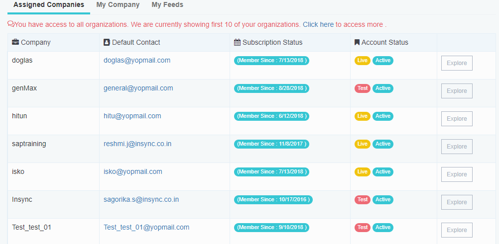
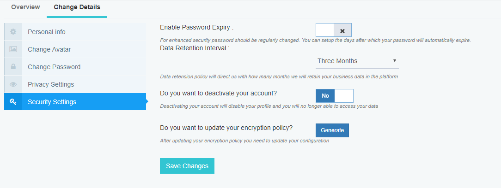

Customer Profile Information	

This section enables you to quickly access your profile after logging into the application. This is where you will get the overview of your organization including assigned companies under you, your organizxaton details and feeds.

This section also enables you to change details like your personal information, changing avatar, changing password, privacy setting and security setting.

Let us dive in details about every section of customer profile information.

My Profile 

Log in to the APPSeCONNECT portal with valid credentials.
Click on your name, then you can view My Profile tab. 

Here you will be able to edit your profile details. Here You will see two tabs - Overview & Change Details page.

In this page, you can view your brief detail like your  name, your registered e-mail, your role, phone number and IP address. To know more about Role Management, click here.

In the Summary section, the count of projects you handle/under organization is shown. You can also see your expired project counts and trials according to your Role and access level, you can see the companies.

Assigned Companies will be shown on User Role basis. In My Company section, only your company details will be there.

My Feeds section is for seeing your recent activities.

By clicking Projects, Workflows, you will be redirected to that particular pages respectively.

If you click on Change Details tab, you can edit all details.

In the Personal Info tab, you can edit your name, mobile number.

Click on Change Avatar to change your Profile picture.

Click on Change Password to change the password and set your new password.

The Privacy Setting section allows you to agree/disagree with the privacy policy. Basic privacy policy includes - Subscribing to Email Notifications & Acceptance of Terms & Condition.

Security Setting - Here you can enable all the security related settings like password expiry time set, account decativation and updating encryption policy. 

