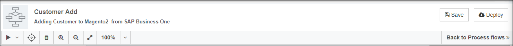
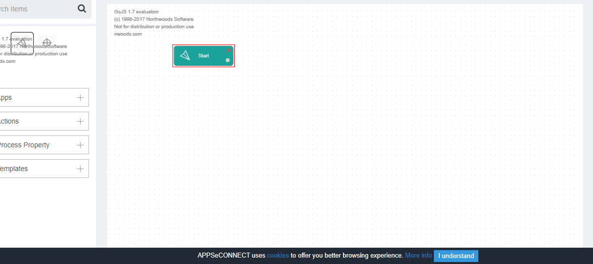
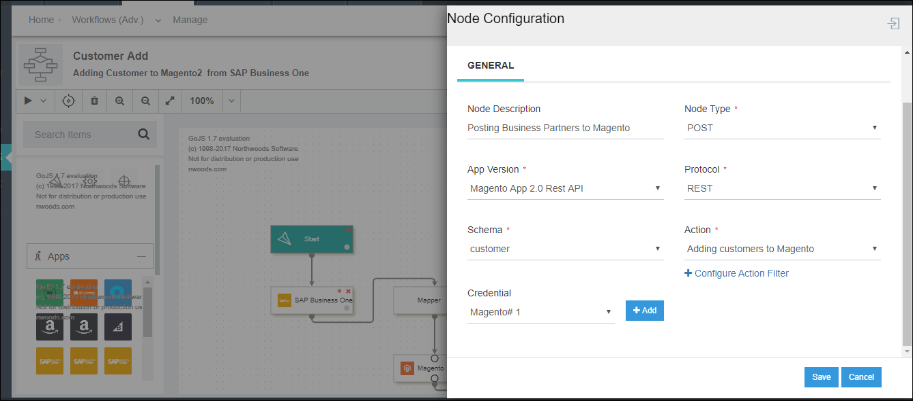

This section of the documentation will guide the user with the process of Creating & Saving new process flows. The steps for implementing the same is provided below:

## Prerequisites for Creating a Process Flows
1.	Should have valid credentials for logging in to the APPSeCONNECT portal.
2.	Applications should be chosen from the apps section, for proceeding with the design of Process Flows.

## Steps to create a Process Flows
a.	Login to the Portal and navigate to the Process Flow module. The Process Flow listing page appears.
     
b.	Click on the folder where you want to create your process flows on the [listing page](/processflow/processflow-listing-page/)      
c.	Click on the new button for creating a new process flow.  
   
**Note: If the Folder is empty, you can view the button Create a Process Flow, that navigates 
you to the Process Flow Designer Page.**    
d.	You will be navigated to the [Process Flow Designer Page](/processflow/designer-processflow/).     

e.	Provide a Name and Description for the process flow in the process flow header panel.        
     
f.	Drag the Start node that signifies the start process of the process flow.    
     
g.	Expand the App menu. You can view all the Pre-packaged application selected in [Choose App](/configuring%20appseconnect/configurations/#process-of-choosing-app) section.    
h.	Drag an application to the [designer panel](/processflow/designer-processflow/) that you want to integrate 
    (in this case SAP Business One & Magento2 ). On dragging the applications to the designer panel, the node configuration 
    slider would appear.        
      
i.	The following are the fields available in the Node Configuration Slider          
* Node Description: This denotes the description of the node.  
* Node Type: This denotes the type of action that the node needs to perform GET or POST   
* App Version: This denotes the version of the Application. You need to select the version of the application you need for the integration.  
* Protocol: The protocols would be listed for the application that is selected.     
* Schema: The schemas for the selected application and protocol would be listed in the drop-down.   
* Action: All the action based on the selected schema would be available. You can also modify Action filters by clicking on the [Configure Action Filter](/configuring%20appseconnect/configurations/#process-of-choosing-app) button.   
* Credential: You need to click the button Add, beside Credential to add token in the list. Select the Credential Token added for storing the credential provided for the application in the OP Agent.    
     
j.	Once all the details are the provided click Save button.       
k.	Drag the mapper node and the destination application in the design panel. The Node configuration slider opens when the destination application is dragged.  
l.	Provide the node configuration details for the destination application and click save button.  
     
**Note: The Node type for the destination applications is selected as POST as data would be posted to the destination application from Source.**    
m.	Join the dragged node from Start to End. On joining the mapper node & the destination application, the transformation window opens. The user can perform the mapping for the applications      
    
n.	You can edit the mapping anytime by click over the node configuration button, available on the Mapper Node. Clicking on the cross button will delete the node from the designer panel.      
   
**Note: Every node has a node configuration button (except Start & End), the configuration window opens when clicked on that button.**    
o.	Once all the nodes are joined, the steps for creating a process flow ends. You can also add other nodes as per the business requirement.       
p.	Click save button once the process flow is designed. The saved Process Flow would be listed under the folder you have created.         
    
q.	Click on the edit button against the created Process Flow, will redirect you to the [designer page](/processflow/designer-processflow/).       
   

Following the above steps, you can successfully create a basic process flow. However, business process will require other nodes for designing as per the requirement.  

