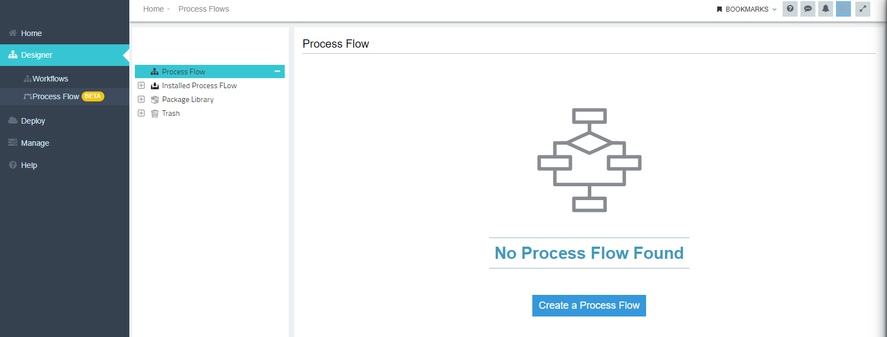
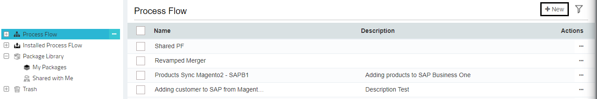
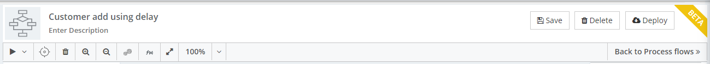
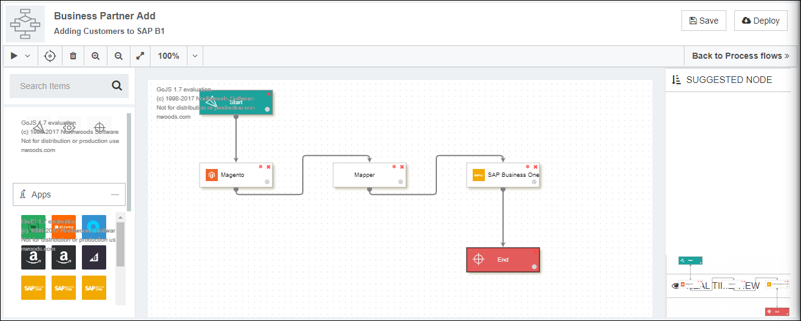
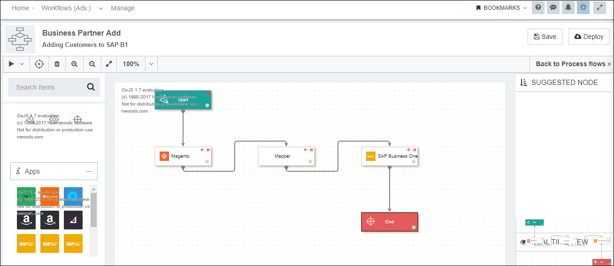
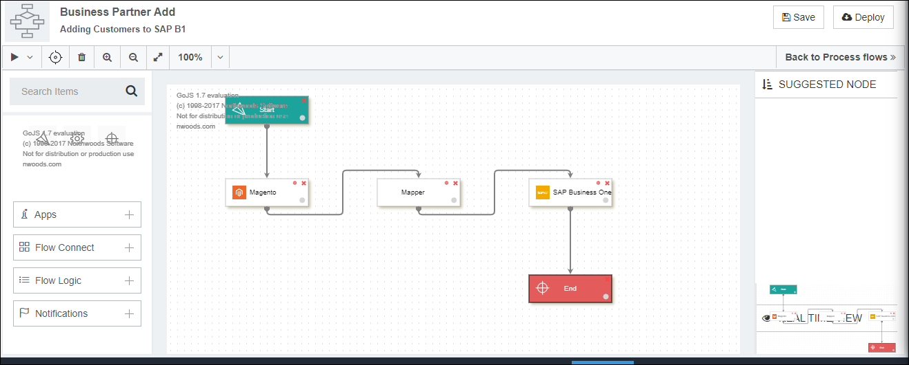

This section enables the user to implement business scenarios by designing Process Flows. Here user would get the detailed usability of Process Flow Designer Page.

* Click on the Create a Process Flow button on any folder in the listing page.
  
* The button Create a Process Flow will only appear when the selected folder is empty. Folder with a created process flow listed will have a NEW button that will redirect the user to the Process Flow Designer Page. 
 
* You will be redirected to Process Flow designer page where the you can design the business specific process flows.

* The page is divided into 4 sections that are static for every Process flow designing page. The following sections are:  
** Process Flow Header panel  
** Process Flow Left panel  
** Process Flow Designer View  
** Process Flow Right Panel  

## Process Flow Header Panel

Here you can provide name and description to the process flow.Navigate to the Process Flow designer page, the field for providing the NAME remains blank. You need to provide the process flow name in the Process Flow header Panel. 

**Note: The process flow name will be a mandatory field for designing and saving any process flows.**

Below the Process Flow name, you get an option to add description to the Process 
Flow. The field for providing the Description to the process flow is an optional field. You can edit the description any number of times as required.

Details of the list of executable buttons are given below:

* Play button: The play button will allow you to execute the saved version of the process flow. 
* Tracker button: You can view the execution status and messages related to execution process in the Tracker Window.
* Delete button: The delete button will allow to delete the selected Nodes and link in the Process Flow. You will get a confirmation pop-up for the delete operation of the workflow. 
* Zoom in: You can zoom in the Process Flows for better viewing purpose.
* Zoom out: You can zoom out the Process Flow for better user experience. Users can also resize the screen accordingly. 

To view the screen in full screen mode, click the Button for Full Screen.
You can also adjust the screen resolution to 100%, 50% & 25% & Fit to Screen as per the need.
Save: The save button allows you to save the following Process Flow for later use. You can edit the Process Flows anytime by clicking the edit button available in the Process Flow listing Page.

You can view the Back to Process Flow button that will navigate you to the listing page. 

## Process Flow Left Panel
Here the users can add Process Flows nodes to the Process Flow designer panel. The nodes
 can be dragged and dropped in the design panel for configuring & designing the Process 
flow. Users can utilize any node based on the business requirement and can view the 
following tabs and menus in the left panel of the page.    

1)	Start:  This node initiates the start of the execution of the Process Flow.  
2)	End: This node depicts the completion of the Process Flow.  
3)	[Mapper](/processflow/mapper-processflow/): This node allows you to map the applications used in the Process flow.       
4)	[Apps](/configuring%20appseconnect/configurations/#process-of-choosing-app): You can view all the Pre-packaged application selected & created. 
On dragging the applications to the designer panel, the node configuration window would appear.      
5)	Flow Connect: You can view the following connector nodes upon expanding: FTP, Database, REST, Connector.   
6)	Flow Logic: Here you can view all the process property nodes namely halt, resume etc required to implement the customer business process.  
7)	Notifications Expanding this menu, you can view all the nodes for implementing actions within a Process Flow.  

## Process Flow Designer View 
Here you can design/create the Process Flow. Drag and drop the required nodes to the 
designer panel for creating the process flow. Expanding the menu in the left panel, 
you can view all the node that can applied for designing the /configuring%20appseconnect/configurations/#process-of-choosing-app Flow.

  

## Process Flow Right Panel
The right panel of the Process Flow Designer Page will have the following sections:  
  
* Suggested Node: Here you will get suggestions of providing nodes that can be applied with the node dragged in the Process Flow designer panel.
* Real Time View: Here you would display the real-time view of the process flow.
