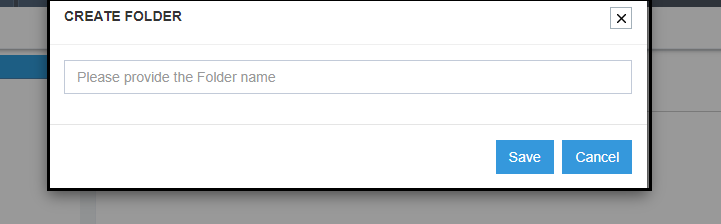
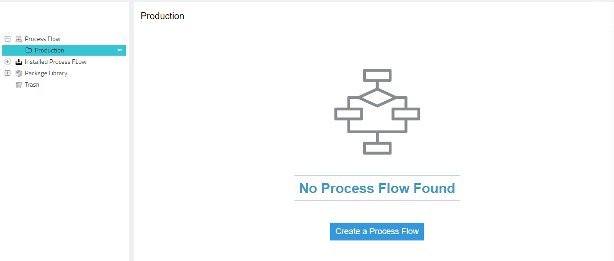
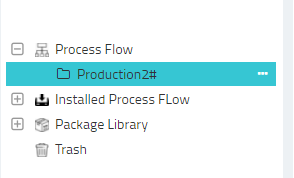

This section provides the option of creating folders for organizing the ProcessFlows with respect to the business 
requirements for any organizations. ProcessFlow listing section helps users to organize & manage all the process 
flows in folder structure such that user can maintain an easy usability as per the requirement. 

**To know more about the modules that would help creating ProcessFlows from the ProcessFlow Listing Page, Navigate to the [Quickstart](/processflow/Quickstart-guide-to-processflow/) section.**

## Processflow listing Page

1. Click on the ProcessFlow folder or any other folder. The listing page for the selected folder is displayed on the right side of the page.  
    
2. The Processflow listing page will list all the processflows that are created in the selected folder.  
3. For each processflows, the following details will be displayed.  
* Name: Displays the name of the processflows.  
* Description: Displays the description of the ProcessFlows.   
* Action: Clicking the three horizontal dots against each processflow, user gets the options to Edit & Delete the exiting ProcessFlow.     
4. Click Edit Button, the **[Designer page](/processflow/designer-processflow/)** opens for the selected ProcessFlow for editing.   
       
5. Click Delete button, the selected ProcessFlow is moved to the Trash folder.  
      
6. The ProcessFlow listing page will have a NEW button on the top right corner  
   of the page for [creating a new processflow](/processflow/creating-processflow/). Clicking on the NEW button, 
   you will be navigated to the [ProcessFlow Designer](/processflow/designer-processflow/)
   
7. The FILTER button is available beside the new button. Click on the button, you can filter processflows using search functionality, from the list.      

## ProcessFlow Folder

On visiting the ProcessFlow listing page, you can view the Home folder. This 
is a default folder and every organisation within APPSeCONNECT would contain the 
Home folder for the ProcessFlow listing page.
 
1. Click on the three horizontal dots of each folder, you can view a NEW button 
in the drop down that would enable the user to create a child folder of the selected folder.

2. You can create multiple child folders under the Home Folder. Users can create maximum
of 50 folders for processflow for an organization.
3. Click on the Home folder, the processflow listing page appears on the 
Right side of  the page. Empty folder will have the view as given below.

4. Now Click on [Create a ProcessFlow](/processflow/creating-and-designing-processflow/) button, the ProcessFlow Designer page opens.

### Usability for the SUB/CHILD Folder

* Every folder (except Trash) will have three horizontal dots (...) that will enable the you to create new child folders.
* Every created folder will have the option - `create a New Child Folder, Rename & delete`. 
* Name of a folder cannot be same if created on same level. However, folder name can remain same if created on different level.

### Steps to create Child Folders in the listing page

Every folder (except Trash) will have ellipsis (...) that will enable the user to create new child folders.  
a.	Click on the ellipsis (...)of the home folder, you can view a NEW button.  
 
b.	Click the new button, you will get the window for adding a new child folder.   
  
c.	Enter the name for the folder and click on the save button. You get  a success message.  

d. You can view the created folder in the processflow listing page upon expanding the HOME folder.  
 
e.	Click on the created folder (example- Production), you will get a message for creating new processflows if the folder is empty. 
Click on the new button, you will be navigated to the ProcessFlow Designing Page.  
 
f.	You can further create child folders for a selected folder by selecting the new option that can be viewed by clicking on the Ellipsis (...)  
g.	All the created folder will get the options to create a new folder, Rename the folder & delete the folder.      
    
h.	Folders on deleting would be moved to Trash with a toaster message for successful completion of the delete process.   

**Note - 
1) Folder name will consist of 50 characters and can have alphanumeric characters. 
Name of a folder cannot be same if created on same level. However, folder name can 
remain same if created on different level.  
2) Full Folder Name is visible by hovering the tool tip over the folder name**

### Steps to Rename a Created Folder

1. You can rename a created folder by choosing the option Rename available under
the drop-down of the selected folder.  
  
2. Click on the Rename folder, the window for renaming, opens.     
 
3. You can rename using any alphanumeric characters. The renamed folder will 
be available in the ProcessFlow List.    
  

**The functionality for renaming is available only for the folders that are created by the user.
The default folders (Home & Trash) cannot be renamed or deleted.**

### Steps to Delete a Created Folder

1) You can delete any created folders by choosing the option delete, available in the 
drop-down of the selected folder.  
         
2) On clicking the delete button, user gets a confirmation message for the deletion process.  
Click Yes button will delete the selected folder.  
        
3) Clicking `yes` button, will delete all its child folders & the processflow present inside it.
The deleted folders will be shifted to the `Trash folder` once deleted from the group level.  
    
4) Folders can even be deleted permanently from the Trash folder, by clicking on the delete button 
for the selected folder under Trash. User gets a Confirmation message for deleting permanently.  
     
5) Clicking on the Yes button will delete the folder, its processflows and Child folders permanently.     

## Installed ProcessFlows folder

This folder will store the incoming installed packages shared to your organisation. Incoming Packages when installed will be available in the **Installed ProcessFlow** folder.
The folder will have sub folders created while installing packages, with the same name as that of the installed package. 

To know more on Installed ProcessFlows, [Click Here](/processflow/processflow-package-installation/)

## Package Library folder

This folder will list you with two Sub-Folders: **My Packages** & **Shared With Me**. Clicking on the **Package Library**, you will be shown the summary of packages you have create and shared in both the Sub-folders.

The Sub-Folders will enable you to perform the following functionalities:

1) My Packages: This folder will allow you to Create, Share and View packages created by you on your organisation.

2) Shared With Me: This folder will allow you to view, installed all incoming packages that are shared with you.

To know more on packaging of processflows, [Click Here](/processflow/processflow-packaging-overview/)

## Trash Folder 

a. You can view the Home & Trash folder in the ProcessFlow Listing Page. Both the Home & the Trash Folder would be available on the same hierarchy level.     
b.	On the listing page, you will be able to view the Trash folder that contains all the deleted folders        
c.	Click on the Ellipsis (...) beside the Trash folder, you  can view the button Empty Trash Folder.     
     
d.	Click on the button Empty Trash Folder, you will get a confirmation message. Click on the yes button for deleting all the folder and processflows permanently.  
 

**Note: You cannot create any child folders under Trash. Default Folders can neither be Renamed nor Deleted.** 

