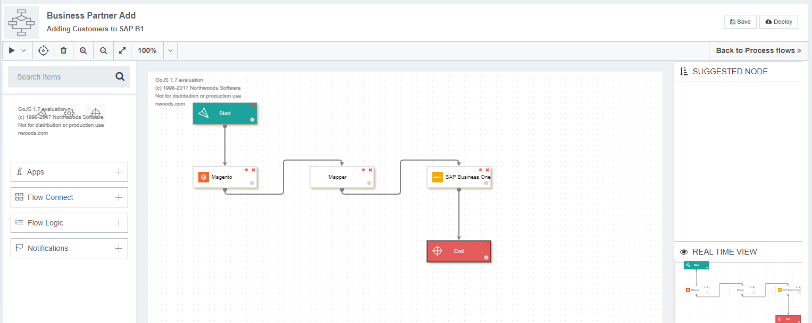
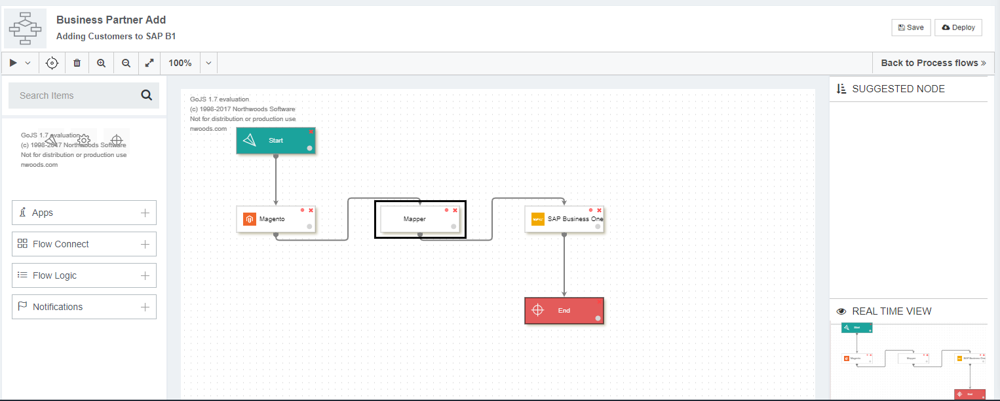
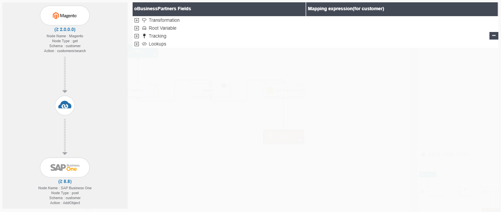
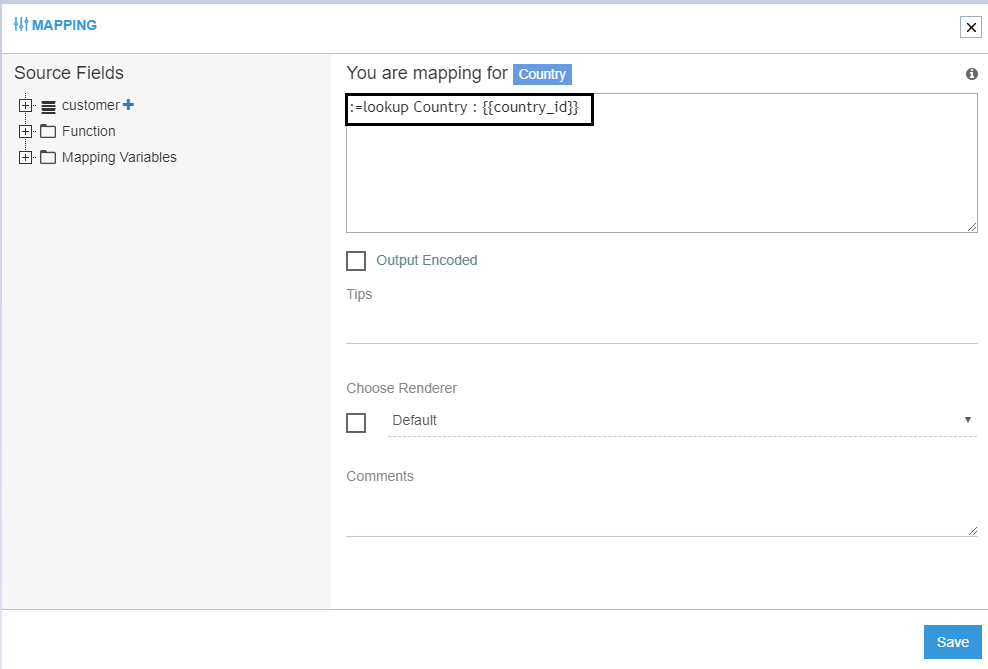
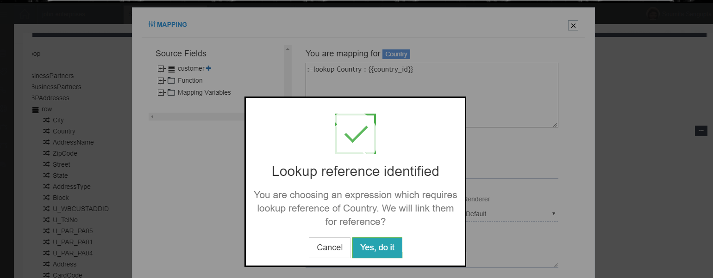

Once the Collection and the Reference tables are created, users can implement those lookups in the attribute mapping for the sync process. 

## Prerequisites for mapping Lookups
* You need to have valid credentials for login into the portal.
* You need to have the Reference tables and Collection created.
* You need to have the process flow created along with the mapper node.

## Steps to implement lookup in attribute mapping
1.	Login to the portal and navigate to the process flow section. The process flow listing page opens. Click here to know more about the Process flow listing page. (Link to the listing page).
   
2.	Create a process flow or edit a created process flow. The Process Flow Designer page opens.    
    
3.	Click on the Configuration node button of the mapper node.  
   
4.	You can view the mapper page after clicking on the mapper configuration button.    
   
5.	Expand the transformation nodes and click on the ellipses button (...) of the attribute where you want to implement the mapping. 
view here for [structure of mapping]().   
  
6.	Open the selected attribute and hardcode the syntax for mapping the lookup. You can map the 
lookup using two syntax formats. The syntax is given below for your reference.    
  
**Syntax 1:Using getMapping syntax** 

        
Where ObjectType is the Reference Table Name & Value is the Source Attribute Name.        
For ex: if your reference table name is Country & attribute name country_id therefore the syntax will be.
   
    
**Note: You will get the function by expanding the function node available at the left-hand side 
of the mapping page. Expand Function > Generic Function & click over the getMapping function.**

**Syntax 2: Using lookup syntax**   

  

The above syntax is a hardcoded syntax. You can code the syntax as given above for implementing the mapping.
For Ex: if your reference table name is Country & attribute name country_id therefore the syntax will be.
     
**Note: You cannot select this function from the function nodes. Implementing this function needs to be done as hardcoded.**

On successfully implementing the mapping in the mapping space, you get a confirmation pop up for mapping the lookup. The screen is given below. Click on the Yes, do it button.
  
**Note: You would not get this confirmation message when the mapping implemented is not syntactically correct.**
 
After finishing the mapping click `Submit` button to save the mapping implemented.   
  
 
Following the above steps, you can successfully implement the mapping of the Lookups for  attributes. 

