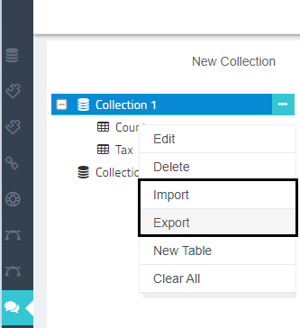
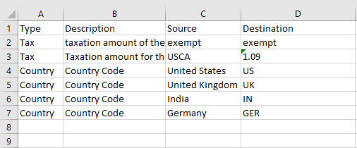
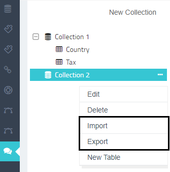
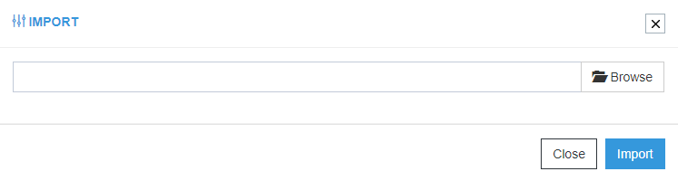
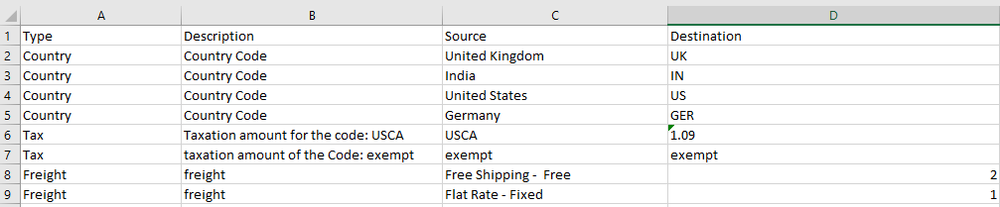
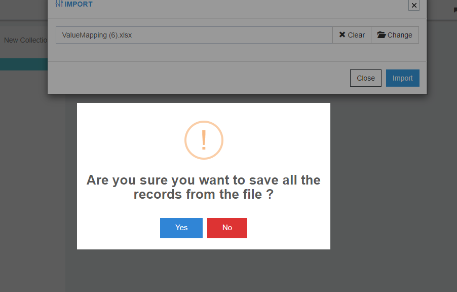
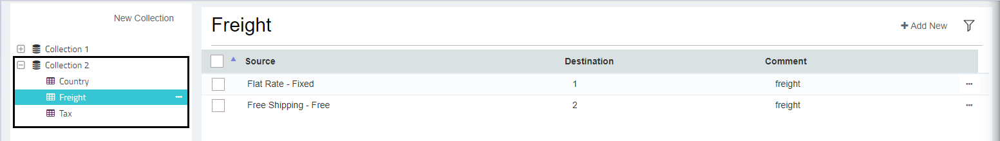

Repositories in APPSeCONNECT provides the user to create and manage Lookup types in form of tables for the organisation. 
As APPSeCONNECT has the approach to provide simpler usability to the users of the platform, 
therefore Repositories in APPSeCONNECT has been implemented with the feature of Import & Export of 
Reference tables that reduces the manual work of the table creation.

Users can import a file in  Excel format (.xlsx) While Exporting, users gets the exported in Excel 
format (.xlsx).

The Lookup Repository is implemented with a format that is followed while 
importing and exporting the Lookups. 

The format for the lookups is given below with an example:

|Type|Description|Source|Destination|
|---|---|---|----------|
|Country|Country Code|United States|US|

* Type: The Lookup type needs to be provided for this column. This is also the Reference Table that would be 
  stored inside the Repository Collection. For Ex: Country, Tax, Freight, PriceLists etc. 
* Description: Needs to provide the description of the Lookup.
* Source: The Source value of the lookup type needs to be provided.
* Destination: The destination value of the lookup type needs to be provided.

Users can Import & Export lookups both from the [Repository Collection & Reference Table](/processflow/Lookup-repository-masterdata/)

## Prerequisites for Importing and Exporting the Lookups
* Should have an organisation created with APPSeCONNECT.
* Users should have valid credentials for login to the APPSeCONNECT Credentials.
* Users need to follow the above given format for importing Lookups to Repositories.

## Steps to Export Lookups from Repository Collection
1.	Login to the portal and navigate to Manage > Repository.
2.	The Repository page opens. Clicking on the Ellipsis (...) of the selected Repository Collection, you can view the option Import & Export button.
  
3.	As the selected collection already has Reference Tables, export the selected Repository Collection by clicking on the Export button.  
 **Note: Users can also export a blank Repository Collection.**
4.	The File will be auto downloaded in Excel Format (.xlsx). 
The exported file will have all the lookup types available inside the selected 
Repository Collection. The downloaded file will display as shown below:  
   

**The column Type is the name of the Reference Table in portal. Exporting a file from a Reference Table will download the records 
 only for the selected table/type. Users need to click the Ellipsis 
 button for the selected table, for viewing the Export button.** 

The steps for `Exporting` remain the same as provided above.

Following the above steps, users can successfully export Reference Tables from Repository Collections.

## Steps to Import Lookups from Repository Collection
1.	Login to the portal and navigate to Manage > Repository.
2.	The Repository page opens. Click on the Ellipsis (...) of the selected
    Repository Collection, you can view the option Import & Export button.  
  
3.	Click on the import button for Importing the Lookup File. The Window for 
    importing the Lookup File appears.
  
4.	Select the file from your system by clicking the Browse button. The File 
    contains the following Lookup records.
   
**Note: The column Type is the name of the Reference Table in portal.**
5.	After selecting the file, click on the Import button. You will get a confirmation message for saving the records of the file. Click on the Yes Button to save lookup records.
  
6.	On clicking the Yes button, the records get uploaded in the selected Repository Collection. On expanding the selected node, you can view the uploaded records.
   
**(a)The column Type is the name of the Reference Table in portal.
  (b) Importing a file from a Reference Table will upload all the records only for the selected table. 
  Users need to click the Ellipsis button for the selected table, for viewing the 
  Import button. The steps for Importing remains the same as provided above.
  (c) Duplicate records will not be imported from the file if already exists for
   Repository Collection or Reference Tables.** 

Following the above steps, you can successfully Import a Lookup Record for a Repository Collection.
 

