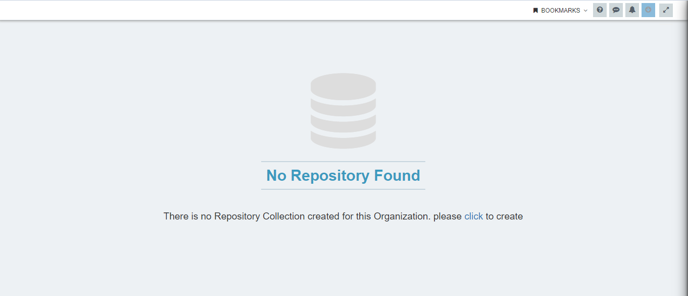
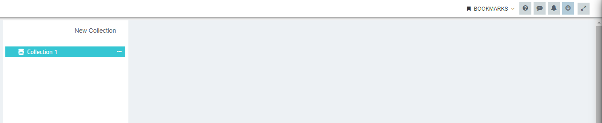
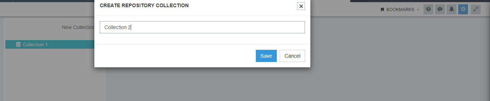
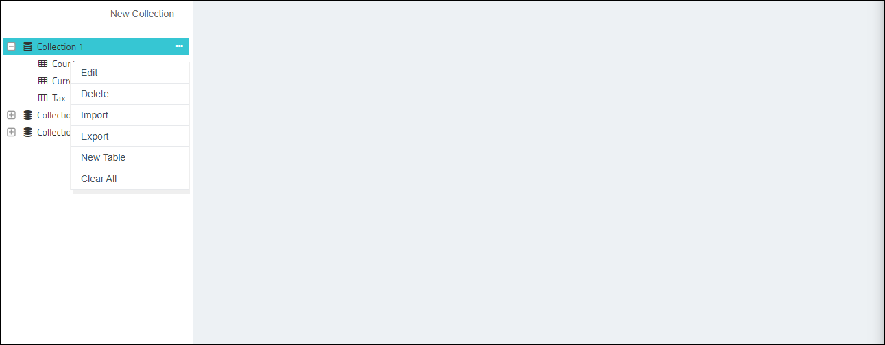
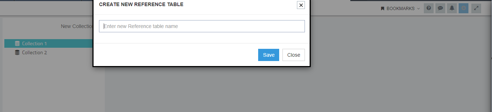
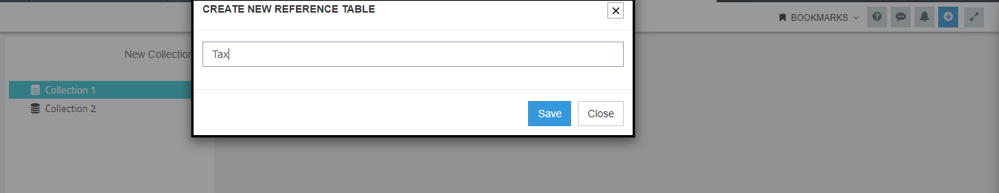
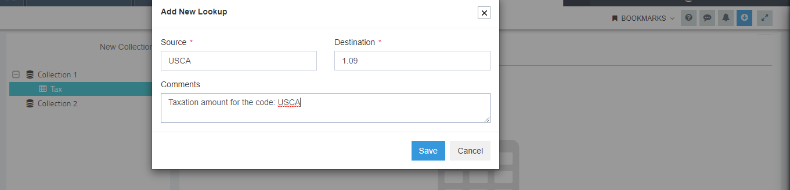
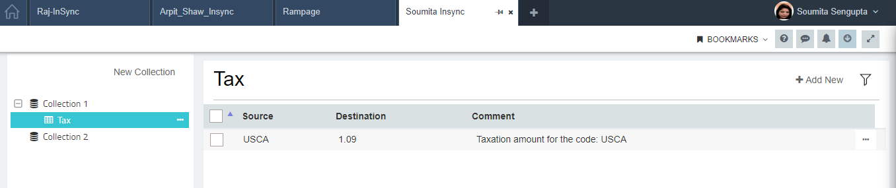
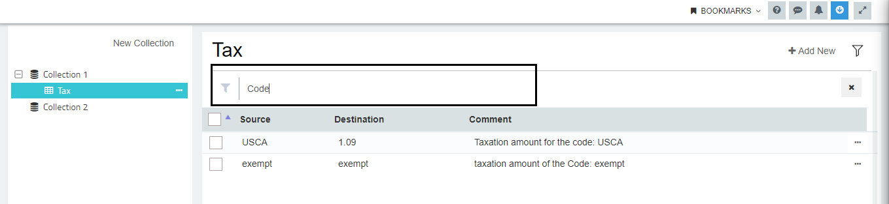
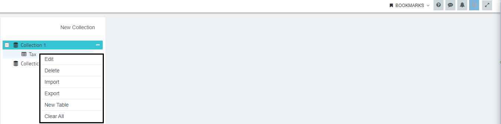

Repositories in APPSeCONNECT provides the user to create and manage Lookup types in form of tables 
for the organisation. Lookups  enable the user to provide specific values to the application 
integration, such that when the source and destination application is integrated, the value in 
source application can easily be integrated with its value in destination application, corresponding
to its field.

Having independent repositories for lookups will help the users to create Lookup collections 
and manage them in separate tables as per their need. Each Repository Collection created will 
multiple have Reference Tables that will enable the users to store and manage the collection 
of Lookup References.

## Prerequisites for Creation of Lookup Repository Collections

* Should have an organisation created in APPSeCONNECT
* User should have valid credentials for login to the APPSeCONNECT Credentials.

## Steps to Create Repository Collections:
1.	Login to the portal and navigate to **Manage > Repositories**. You can view Repository landing page, if creating for the first time.  
   
2.	Click the button to Create a new Repository Collection. The window for providing the name for the Repository Collection opens.  
  
3.	Enter the name for the Repository Collection and click on the SAVE button.  
  
4.	Click SAVE button and you can now view the Repository Page. The created Repository Collection will be present in the tree.  
   
5.	You can create another Repository Collection by clicking the `New Collection` button.  
  
6.	You will get the same view of the window as given in the previous steps.    
 

**Note: You cannot create multiple Repository Collection with same name.
Following the above process, you can successfully create a multiple Repository Collection.**

## Reference Tables
Reference tables are the collection of Lookup references which can be created under each Repository Collection. The steps for creating Reference Tables are given below.

Prerequisites for Creating Lookup Reference Tables
* Should have an organisation created with APPSeCONNECT.
* User should have valid credentials for login to the APPSeCONNECT Credentials.
* Should have a Repository Collection created.

**Note: User cannot create a Reference Tables with same name under a single Repository Collection.**

## Steps to Create Reference Tables
1.	Login to the portal and navigate to **Manage > Repositories**. You can now view the Repositories Screen  
  
2.	On clicking over the Ellipsis icon (...) beside every Repository Collection, user gets the 
following option.  
a.	Edit: You can Rename the collection by clicking Edit Button.  
b.	Delete:You can delete the whole Repository Collection including the Tables inside it, by clicking on delete button.   
c.	**[Import](/processflow/export-and-import-lookup/#steps-to-import-lookups-from-repository-collection): You can import an excel file for creating reference tables from your local system.**  
d.	**[Export](/processflow/export-and-import-lookup/#steps-to-export-lookups-from-repository-collection): You can export the created lookups to your local system.**    
e.	New Table: You can create a new table under the selected Repository Collection by clicking on new table.  
f.  Clear All: You can clear all the data of the Repository Collection by clicking on this option. You will get a warning ,essage,
click `Yes` to proceed, else click `No` to cancel.    

3.	Click `New Table` button and you will get the window for naming the table.

4.	Input the table name and click on Save button. 
  
5.	You can view the created table under the selected Repository Collection. Click over the table, to  get this view. 
  
6.	Click  `Add New` button, for creating new lookups under the selected Reference Table. The Add New Lookup wizard opens.
  
7.	The `Add New Lookup` wizard has the following fields. Click  SAVE button once the details are provided.  
a.	Source: Need to provide the source value.   
b.	Destination: Need to provide the destination value.  
c.	Comments: You can provide short descriptions for identifying the lookups workaround.      
  
**The Source and the Destination is a mandatory field for saving the lookup.**
**Maximum length for entering the Values in Source & Destination field is of 100 Characters** 
8.	Click Save and you can view the lookup created under the selected Reference Table. 
The Reference Table page of the selected table will list all the lookups created in the form of Table Rows.
The page will display these columns.  
a.	Source  
b.	Destination   
c.	Comments    
      
9.	Every lookup in table rows are editable. Clicking on each cells of the table rows will enable you to edit all the three fields. Clicking on the Tick icon will update the changes made for the lookup. You will get a confirmation message for updating successful. The Cross icon will cancel the operation. 
  
10.	You will get a Delete option, when clicked on the Ellipsis icon (...) beside each table rows.  
  
11.	User can create multiple lookup rows by clicking on the Add New button available on the top right of the page.
    Although User cannot create multiple Lookup Table Rows with same Source values under a single Reference Table.
    
**Note: User cannot create multiple Lookup Table Rows with same Source values under a 
single Reference Table.** 
12.	You can filter rows by implementing search. The search function 
will filter options available with the selected Reference Table.  
    
13.	You can perform multiple action in the Repository Collection level. 
Click on the Ellipsis icon (...) user can view the following options.  
a.	Edit: Enables you to rename the Repository Collection  
b.	Delete: Deletes the Repository collection including all the created tables inside it.     
c.	[Import](/processflow/export-and-import-lookup/#steps-to-import-lookups-from-repository-collection): You can import an excel file for creating reference tables from your local system.     
d.	[Export](/processflow/export-and-import-lookup/#steps-to-export-lookups-from-repository-collection): You can export the created lookups to your local system.       
e.	New Table: Enables you to create a new table inside the selected collection.     
The process for creation remains same as given in the previous steps.  
d.	Clear All: Clears all the Reference Tables present inside the Repository Collection.    
     
  
**Note: (a)The Source and the Destination is a mandatory field for saving the lookup.  
        (b) Maximum length for entering the Values in Source & Destination field is of 100 Characters.**

Following the above steps, you can successfully `create multiple Repository Collections` and `Reference Tables` inside it.

