The data coming from the source schema requires to be transformed individually such that it matches the format 
of the destination schema every time the processflow is synced.

E.g: Suppose the user is executing Invoice Add Process Flow in this case the records of all 
the Invoices are drawn from the source app and for this case the similar execution process
of transformation is deployed multiple times

## Prerequisites for Working with Mapping

* You need to have valid credentials of the portal.
* You need to navigate to the [Process Flow listing page](/processflow/processflow-listing-page/) for creating or editing a Process Flow
* You need [create a Process Flow](/processflow/creating-processflow/) or Edit an existing process flow for implementing Namespace in Mapper node. 

**Protip:** In case of Custom Apps, Transformation or Mapping can be executed or implemented while creating processflow
{: .notice--info}

## Steps to create Attribute in Processflow Mapper node

1.	[Create a New Process Flow](/processflow/creating-processflow/) or Edit an existing Process Flow for implementing Namespaces. You can view the [Process Flow Designer Page](/processflow/designer-processflow/). 
Click on the Node Configuration Button of the Mapper node.       

2. You can view the Transformation screen of the Process Flow. Expand the transformation 
node for viewing the `Schema Object, Complex Object collections, the Complex Object and the Attributes`.

3. Expanding the `For-each loop` the user gets the view of the node oInvoices. `oInvoices` is a schema
  that is used to send data to the target application. The `For-Each Loop` is set relatively rather than writing the transformation logic multiple times and
  this undergoes execution whenever the processflow is synced in the For-Each Loop Node.  

4. You can create custom attributes, which is defined in Complex Object & Complex Object Collection level. 
Click on the Add Attribute button available in the context menu.  
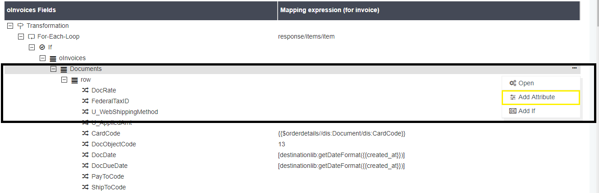
5. You will be able to view the window for creating a new attribute. Following are the fields that would be available for creating the Attribute.
* Attribute Type (Optional) - Defines the Active/inactive behaviour of the Attribute.
* Attribute property (Optional) - Here, you can define the nature of the attribute by selecting the checkboxes. You can select multiple checkboxes at a time.
* Attribute Name (Required) - You need to define the name of the attribute.
* Data Type (Required) - You need to select the datatype of the attribute from the drop-down list.
* Reference API (Optional) - This field gets activated when the datatype of the attribute is selected either as Complex Object or Complex Object Collection. Since, the mentioned datatypes are reference entity, therefore you need specify the Reference Schema from the drop-down list.
* Tags (Optional) - You can specify special tags for the created attribute.
* Namespace Prefix (Optional) - You can also specify Namespace Prefix for defining its unique nature.
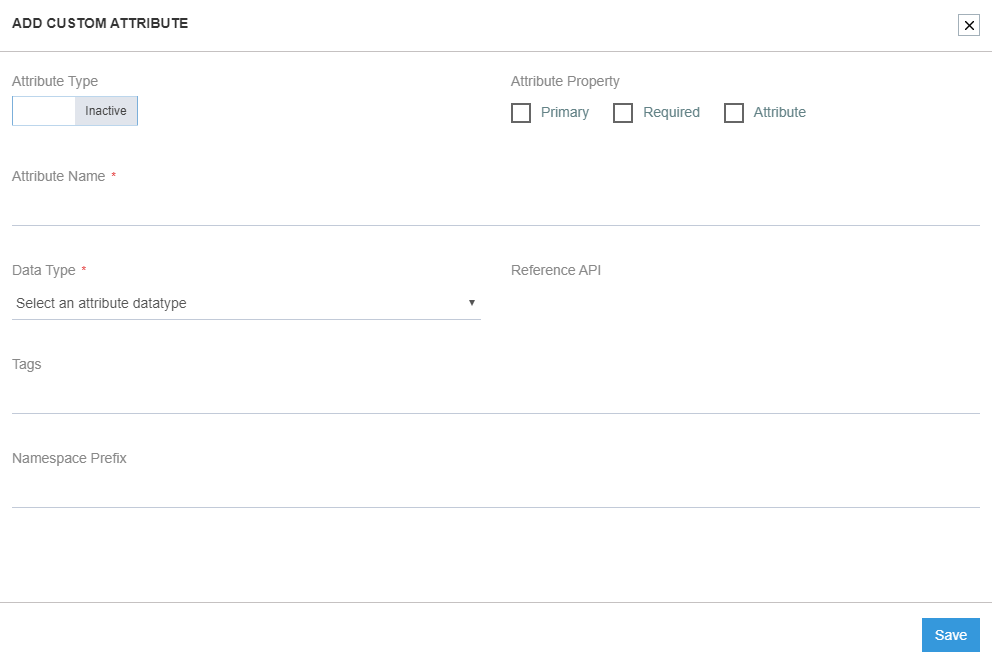
6. Provide the details and click on the SAVE button.
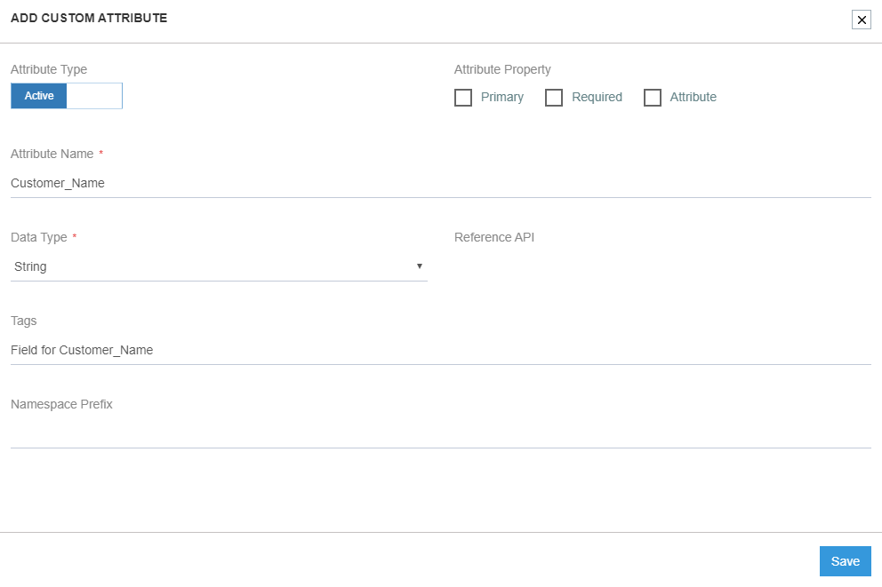
7. You can successfully view the attribute under the complex object or Complex Object Collection that you have chosen while creating.

8.	Click on the Ellipses (...) of the created Attribute you view the following options in the context menu. 
For the attributes which are not mapped, options available is:
a.  OPEN
b.	Delete Attribute
c.	Edit Attribute
d.	Add If 
For the attributes which are mapped, options available is:
* Disable - This option is for disabling the mapping, if not required.
* Open - The mapping window will open, if clicked on Open. Here, you can either map or edit an existing mapping.
* Clear - This option clears out the existing mapping.
* Delete Attribute - Deletes the created Attribute.
* Edit Attribute - Enables you to edit the attribute
* Add If - If-Else conditional mapping can be implemented, if clicked on this option. 
**Note: Pre-packaged attributes will not have the option for Delete and Edit.**
9.	Click on the Edit Attribute button, you will get the following window.
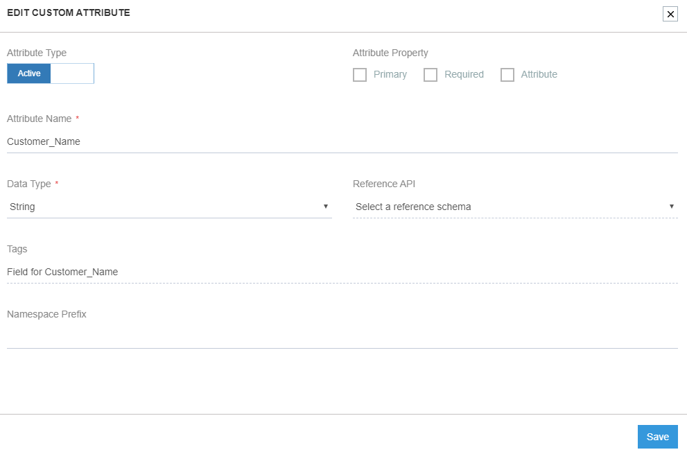
10. Edit the fields as per your requirement and click on the SAVE button.
Following the above process, you can successfully create and edit an attribute.

## Implementing Attribute Mapping
1.	Click on the Node Configuration Button of the Mapper node.
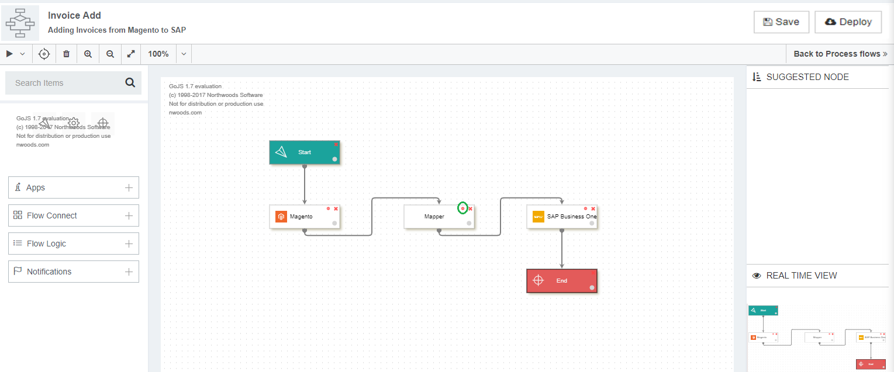 
2.	You can view the Transformation screen of the Process Flow. Expand the transformation node for viewing the Schema Object, Complex Object collections, the Complex Object and the Attributes.
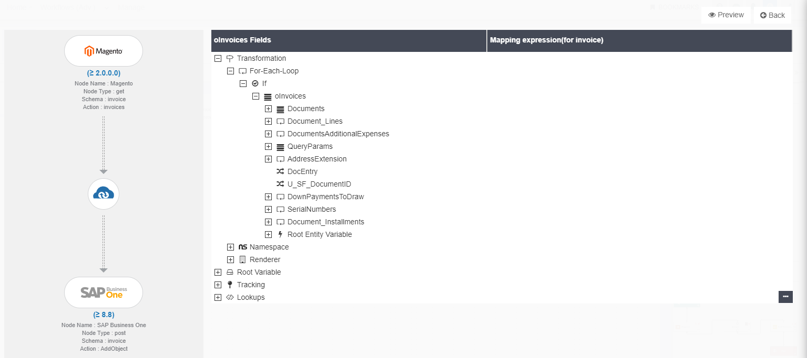 
3.	Expanding the For-each loop the you will get the view of the node oInvoices.
 
4.	On expanding oInvoices (Schema Object) you will get the view of the several complex object collections and the attributes that are listed under it. 
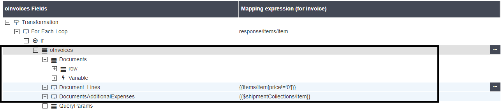 
**Note: Document_Lines will contain the details of the Product in terms of Quantity 
and Unit Price etc., DocumentsAdditionalExpenses contains the Freight, Tax information etc.** of the product.
5.	Expand the row to view the destination attributes. 
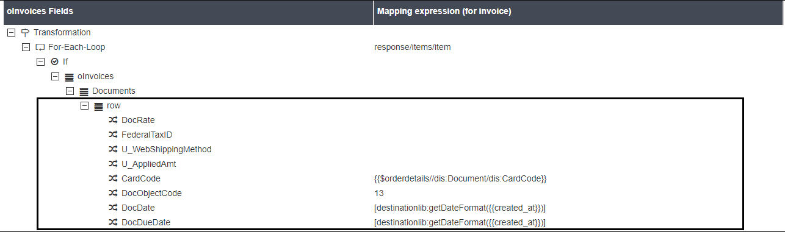 
6.	Click on the Ellipses (...) button beside the attribute , you can view the following option in the context menu. 
For the attributes which are not mapped, options available is:
a.	 OPEN
b.	 ADD IF
For the attributes which are mapped, options available is:
*	Disable -This option is for disabling the mapping, if not required.
*	Open - The mapping window will open, if clicked on Open. Here, you can either map or edit an existing mapping.
*	Clear - This option clears out the existing mapping.
*	Add If - If-Else conditional mapping can be implemented, if clicked on this option. Click here to know more
Note: Custom Attributes create by you will have extra options in the context menu. Click Here (Attribute Creation) to know more about Custom Attributes.
7.	Click on the Ellipses (...) button beside the attribute and select the option OPEN button from the Context menu. You will be able to view the Mapping window.
 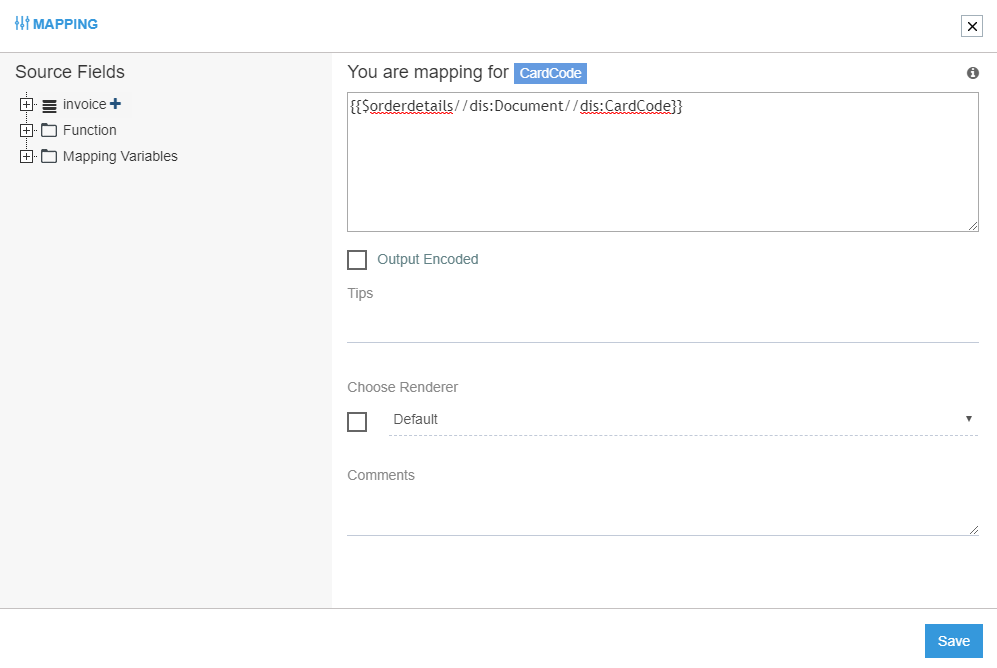
8.	 The mapping window has multiple sections and fields. Expanding the nodes in the Source Field section displays the appresource functions and the source attributes that is required for the mapping. On expanding the Source Schema Object node (in this case invoice) displays all the source attributes.
 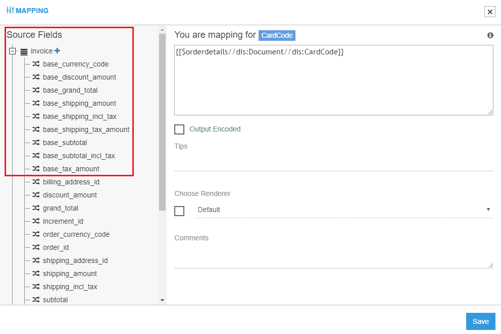
9.	Expanding the node FUNCTION, you can view all the functions listed under Generic Source, Destination and Cloud Appresources.
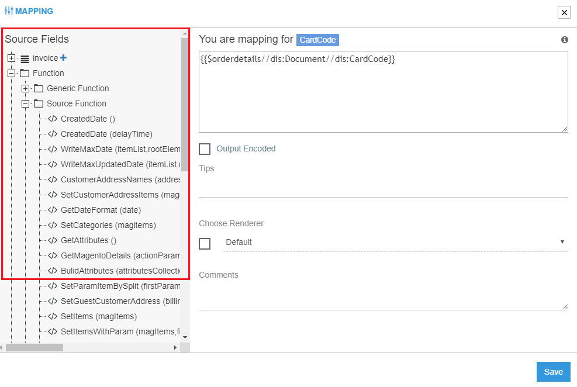 
10.	Clicking on any of the functions, will display it in the mapping panel. Once the mapping is done, Click Save button for Enabling and Saving the mapping.

**Note: The Tips field is for providing or noting down certain tips that might be required for the mapping for 
later use similarly.Comments field is providing comments specific to this attribute mapping that might be 
required later. The Output Encoded checkbox is for ensuring that the generated data is kept intact irrespective 
of the XML standardisation.**

Following the above process, you can successfully map attributes in Process Flow Mapper Node.

## Implementing Attribute Sorting in Mapper Node
1.	For any attributes that needs to be enabled for sorting, you at least need to save a blank mapping.
2.	Attributes and variables with no mapping will neither be allowed to sort in the mapping tree, nor will it be displayed in the XSLT preview.
3.	You can sort the order of attributes and variables in the mapping page by dragging and dropping the same under its parent only if the mapping for the attribute has been done or if it is blank.
4.	You can view the attribute CardCode positioned below the attribute U_SC_QuoteId.
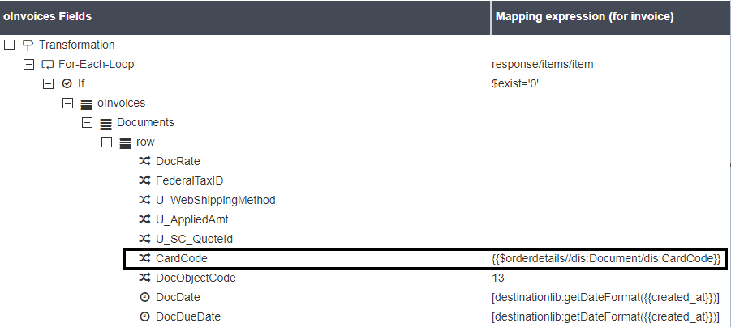
5.	Here, you can view the attribute is sorted and is positioned on top.
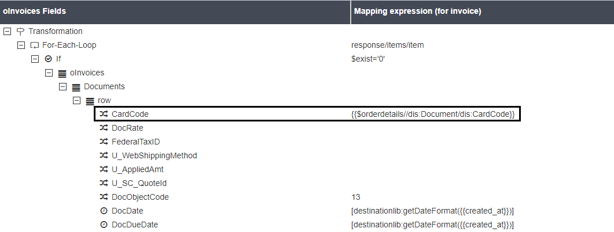
Therefore, you can successfully sort attributes by following in the above mentioned steps and conditions.

