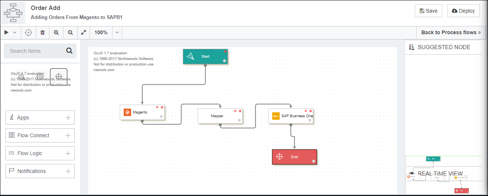
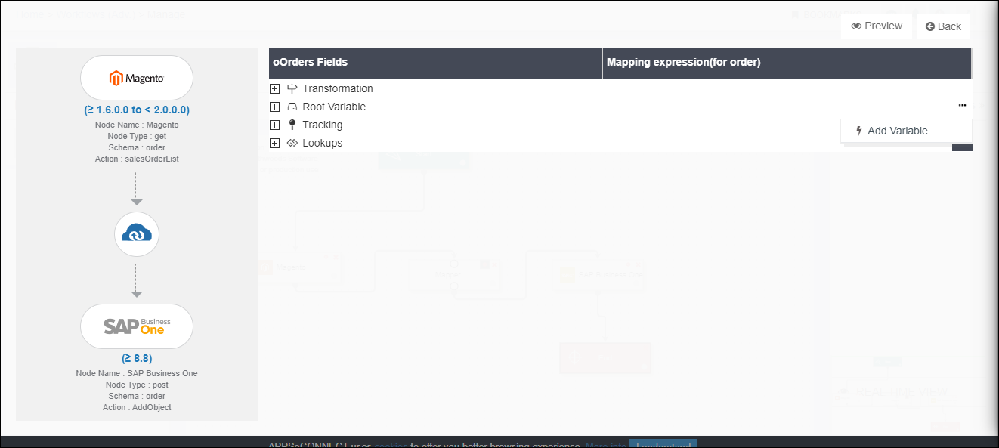
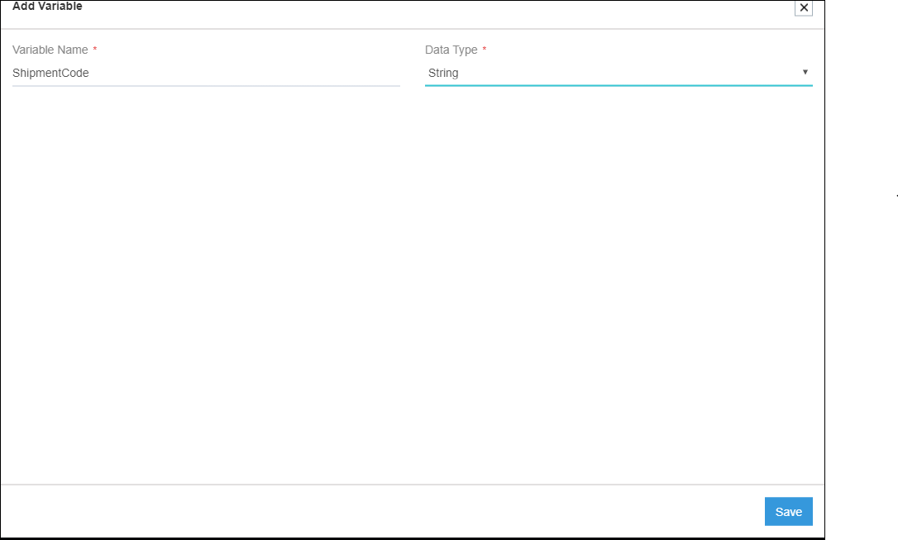
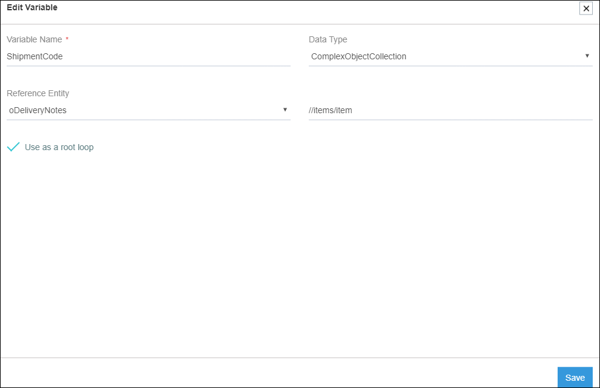

Here you will understand the process of defining [Variables](/transformation/types-of-variable/) (any variables that stores the data that can be used later within 
the process of transformation) and then mapping of variables during transformation phase. 

Here The flow is explained using `Root Variable` for a processflow.   
**NOTE- The process of defining the variables remain same for any type of variable.**

## Prerequisites for adding Variables in Processflow Mapping
* You need to have valid credentials of the portal.
* You need to navigate to the [Process Flow listing page](/processflow/processflow-listing-page/) for creating or editing a Process Flow
* You need to [create a Process Flow](/processflow/creating-processflow/) or Edit an existing process flow for implementing Namespace in Mapper node. 

 
 
1.	Select the processflow for which the Root Variable is to be created. Click on the Node 
Configuration button for the Mapper node after linking the application nodes for viewing the mapper window.

2.	Click on the Option `ADD VARIABLE` present on the Transform Window.

4.  Input the details Variable Name, Data Type and the Reference Entity.               
      
(a) In this case Variable Name `ShipmentCode` is used whose Data Type is provided `String`. The flow remains same for the 
Data type-  Bool, Datetime, Number and Double.  
(b) Whereas for the `Data Type - Complex Object, Complex Object Collection and Double` providing the XPATH is mandatory as
shown below  
 
Once the details are filled, click Save and Close. 
For Mapping the variable, click on the Open button, which is visible beside the variable name, when hovered over.
Select the function from the `Functions List`  and click on the function as required (Taken [genericlib:getMapping(ObjectType,Value)] as an example)    
**Note: The mapping can be executed with the functions as well as, with the source attributes. Implementing mapping only with the functions is not mandatory.**

   
Now for implementing the mapping, input the required ObjectType and Value in the Function syntax. Click on the Submit Button, on completion of mapping.  
   

The user can view the successful sync of the processflow for which the Variables was created

## Delete variable
The user can delete the Variables whenever required, any-time after its creation by clicking on `delete variable`.
button. Hardcorded variables cant be deleted.  

## Edit Varibale

The user can edit the variables defined any-time after its creation by clicking on `edit variable` button.
Hardcorded variables cant be edited.  

