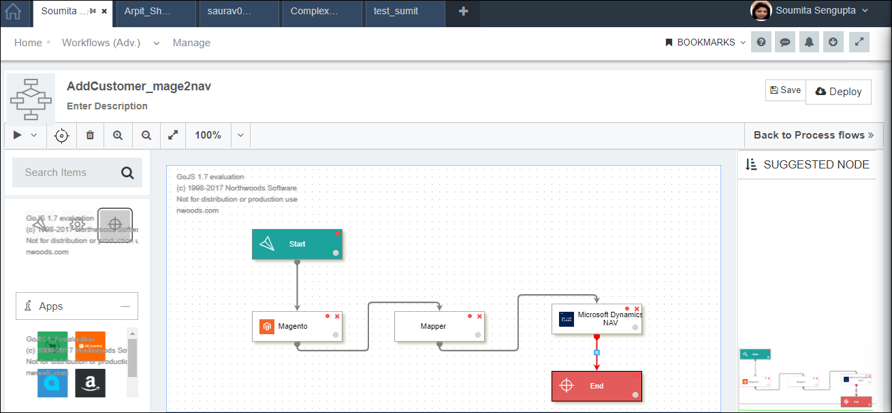
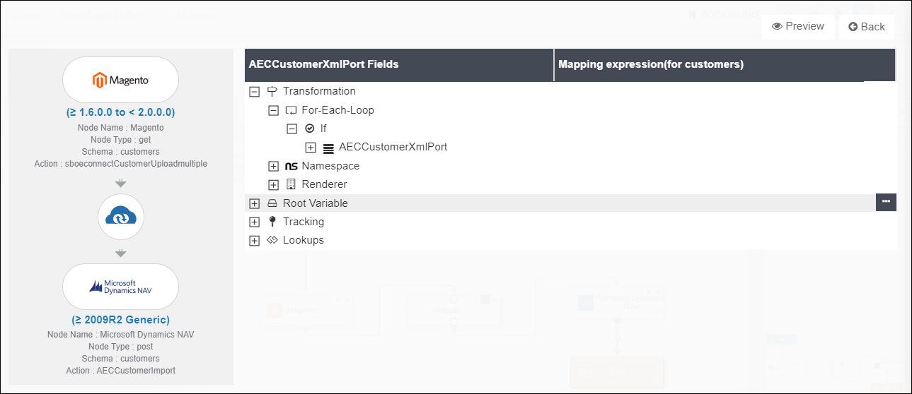
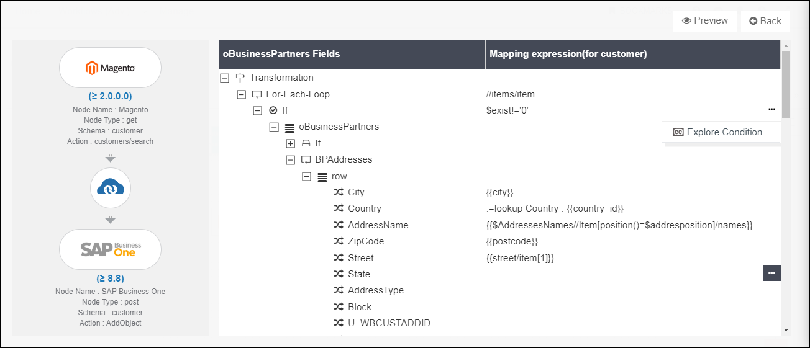

Mapping in APPSeCONNECT is done so that a Source Application can communicate with the Destination Application. APPSeCONNECT, introduces a new mapping structure If-Else Mapping. This Document will talk about this mapping process and in different levels where we can apply the If-Else Mapping.

## Pre-requisites for Mapping
* Login to the APPSeCONNECT Portal with valid credentials.
* Navigate to the [Process Flow Section](). Here You can view the [Process Flow Listing Page]().
* [Create a New Process Flow]() or [Edit an existing Process Flow]() for defining logic over 
detination mapping. 

## Mapping Levels

Mapping is done at various level of Input Packet. 

### Mapping at Attribute Level

Go to the process flow [designer page]() and open the process flow

Click on the mapper node to define mapping at various level.The mapper node expands and the following screen appears as shown below

The user/implementer can work on If-Else Mapping in the attribute level. Given below is the Screen where the If-Else Mapping is done at the Attribute level.  

The user can add condition and attributes from the drop-down option for which the If-Else mapping will work.

**Note: The user can add conditions (Else-If & Else) inside an IF Node similarly as shown in the screen below, except for the FOR-EACH LOOP LEVEL.**

*The above mapping scenario is explained below*

The Condition `default-address/country-code='US'` in the IF Node describes that if the Country Code in the default address is US, the clause Country_Region_Code=HU is carried out.

The Condition `default-address/country-code='IN'` in the Else-If node describes that if the Country code in the Default Address is IN, the clause Country_Region_Code = GB is carried out.

And for the Otherwise (ELSE)Node,the given clause will be carried out.

Refer the screen given below:

The User can also add Else-If and Else(Otherwise) and its clauses in the attribute Level. The following screen shows the Condition add for If-Else.  

### Mapping at Loop Level

The `If Mapping can be done at the For-Each Loop level`. Below is the screen which shows the **If Mapping** at the For-Each Loop Level.  

**Protip** In the For-Loop Level, only IF is used as this level is just for removing duplicate check and also removing junk data, for integration process 
{: .notice--info}

### Mapping at Complex Object Level

The user/implementer can work on the If-Else Mapping in the complex object level. 
Below is the Screen which shows the If-Else Mapping at the complex object level.  

Like other levels, the user can add Else-If and Otherwise and its conditions from the drop down. 

### Mapping at Complex Object Collection  Level

The If-Else Mapping can be done at the ComplexObjectCollection Level. Below is the screens which shows the Mapping at that level.  

  

## Respect Hierarchical Rendering on Mapping state

On disabling the mapping of the parent node, it disables all the child node such that when the XML is rendered, 
only the enabled node will be rendered in the XML. This feature will help the user to implement
the hierarchical rendering feature in the APPSeCONNECT Portal.

**Prerequisites**

Mapping should be done in the parent node for accessing the Enable/Disable feature.

**Steps to implement hierarchical rendering on mapping**
1.	Login the APPSeCONNECT Portal.
2.	Navigate to the touchpoints area after [creating a connection](/getting-started/#creating-connection--executing-the-touchpoint) 
3.	Choose any touchpoint and click on the Transform button.
4.  On `expanding the schema object`, all the `complex objects and the complex objects collection` are displayed.
     
5.	Hover the icon over the mapped complex object/complex object collection. The Disable option will appear. 
        
8.	Click the Disable option, the complex object/complex object collection and its child, sub-child, 
    all the nodes get disabled, present under it.
     
     
**Note: The ROW Node remains white even on disabling. Its colour will only change if the row node is also mapped.**
     
9.	Now, if a child node is enabled from the list of disabled nodes, the child gets enabled, also its immediate parent gets enabled.
     
Now if the immediate parent is also associated with a parent (a complex object/complex object collection), it also gets 
enabled, rest all other child nodes on that tree, remains disabled. 

**Protip:** The Disabled node turns grey on disabling.
{: .notice--info} 
