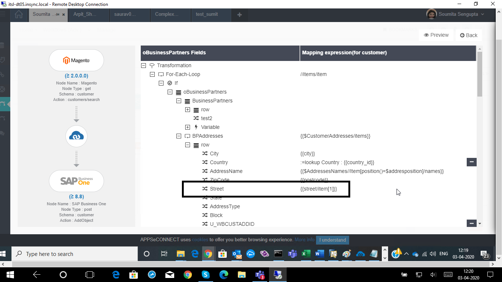

[XPATH](/transformation/understanding-xml-and-xpath/) is an essential concept that is required when implementing mapping and transformations. XPATH access 
nodes in a hierarchical structure as represented in the XML file. 

## Pre-requisites for implementing Xpath in Mapping
* Login to the APPSeCONNECT Portal with valid credentials.
* Navigate to the [Process Flow Listing Section](/processflow/processflow-listing-page/). Here You can view the list of existing Process Flows.
* [Create a New Process Flow](/processflow/creating-processflow/) or Edit an existing Process Flow.
* If you are using [Tech app](/configuring%20appseconnect/configurations/#b-technology-app-creation) and [Custom app](/configuring%20appseconnect/configurations/#a-create-custom-app) create the app prior to designing process flow.

## Basic Flow
1.	Navigate to the processflow from [process flow listng page](/processflow/processflow-listing-page/), for which the Mapping is to be done.
2.	Click on the Mapper node on the processflow you have selected. The user will now be able to view the Transform screen of that processflow.  
  
3.	Expand the Transform node till the Complex Objects and the ComplexObjectsCollections are visible.  
**Note: In this case the processflow Business Partner add is used for the connection Magento2 and SAP B1.**
4.	In the ComplexObject `BPAddresses`, XPATH has been provided for mapping the attribute Street.  
  
**Note: The XPATH should be provided based upon the INPUT packet generated after the sync process. As a prerequisite, the processflow should be deployed and executed for viewing the XML nodes structure hierarchy.**  
5. The XPATH mapped is `{ {street/item[1]} }`. [1] indicates the first position instance of the node item under 
   the element street shall be accessed.
6.	For easy know-how, view the input packet provided below.

**ProTip:** XPATH can be mapped in any entity, be it a ComplexObject, ComplexObjectCollection or an attribute. XPATH can be used for mapping in variables too
{: .notice--info}

The user can view the successful sync of the processflow for the connection Magento2 and SAP Business One.
The user can implement rendering when required for any process flow.
[Click Here](/transformation/troubleshooting/) to know more about the troubleshootings. 

