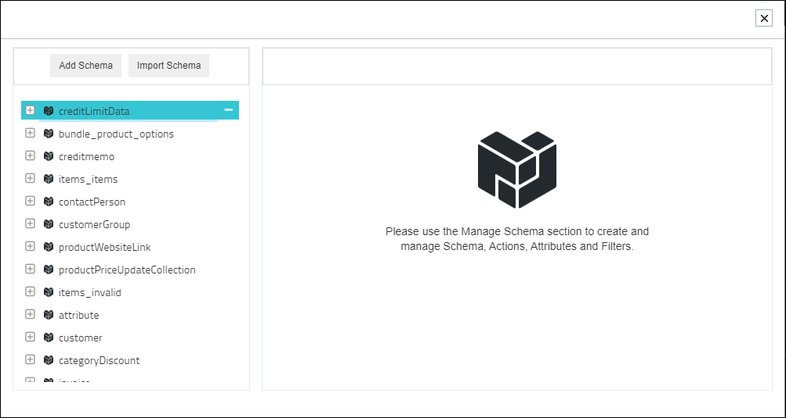
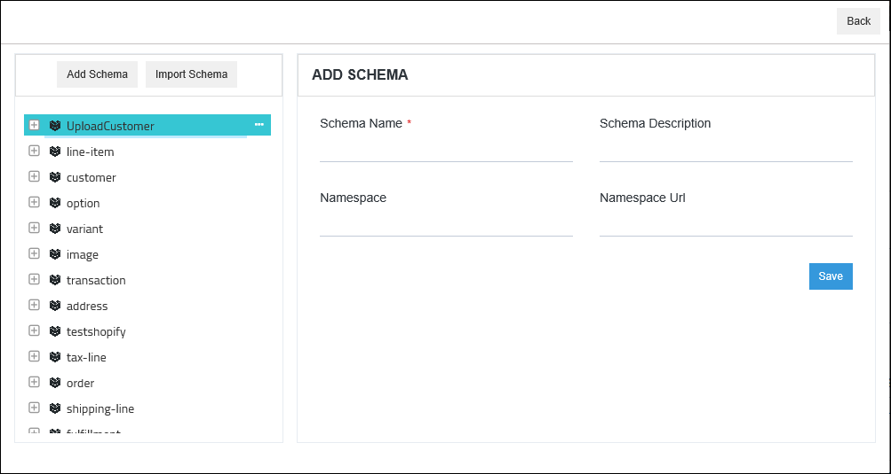
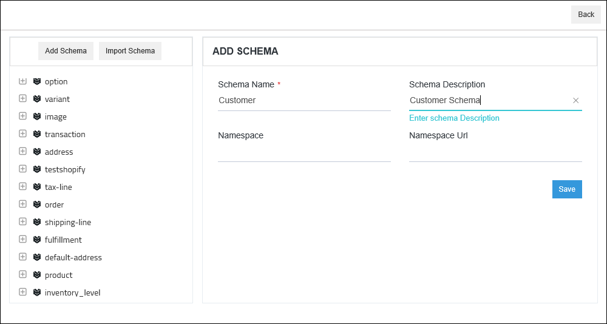
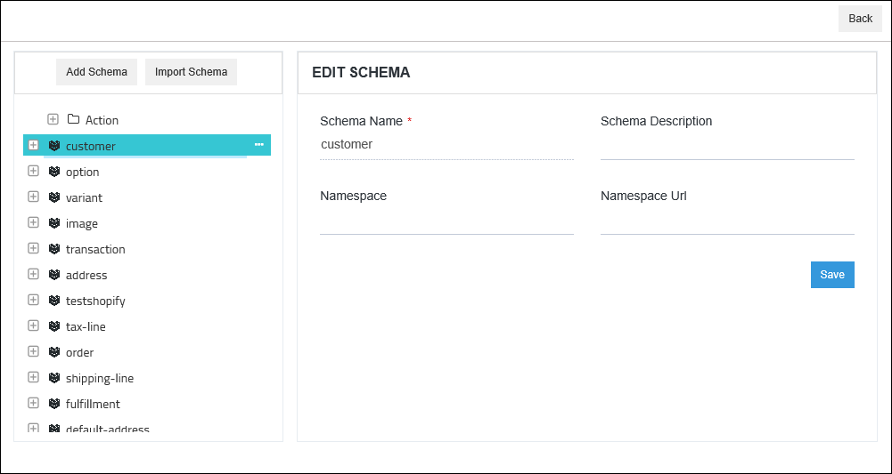
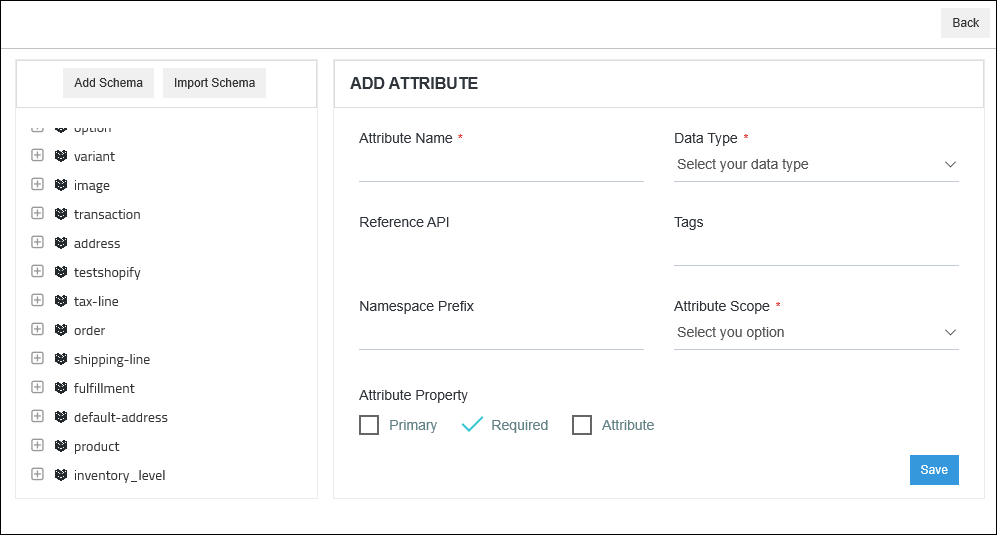
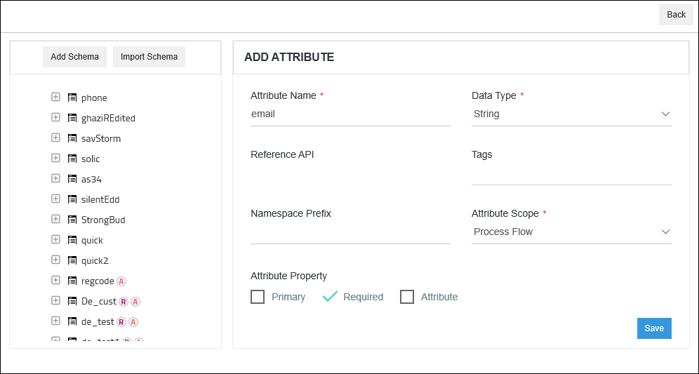

The user can view the schemas  present in an app and can also add schema and import schemas and attributes for application node used in processflow. 
This section enables the user to view, add the Schema, Attributes of an application in the processflow and managing the same
within a processflow for easy execution. The added schema and its component from the application node will
be visible from the APP Section of the portal as well. 

## Prerequisites
- The User should have a valid APPSeCONNECT account.
- APPSeCONNECT should be up and running
- An application node  is needed for defining the Schemas and Actions.

## Listing of Schemas and Attributes

processflow allows a defined tree view listing structure for managing and viewing
defined Schema, Attributes and Actions associated with it. 

To view the listing of Schemas and Attribute,  navigate to the following section:   

(a) Go to Portal and Navigate to **Designer > processflow** module.

(b) Go to [desiger](/processflow/designer-processflow/) section and Drag the required App Node.

(c) The Node Configuration window opens. Go to General tab and Click `Manage Schema`.

(d) A window opens up and here you can view the listing of all the Schema and Attribute(s) of the Application will be displayed in the Tree view on the left pane.

* The Schemas are arranged in a same level hierarchy whereas the attributes and actions associated with the schema is arranged in the second level hierarchy.

* Newly created attribute is arranged under Attribute node.

* The Action Filters and Retry Filters associated with an action are arranged in the third level hieararchy under attributes

**Note: Any Changes done to the Schema and Attributes from the Portal->> App module will be displayed in this section.**

Thus listing view gives a clear synopisis to the user regarding the Schema access and Management from the processflow node configuration level. 

## Adding Schemas in an Application node of processflow 

1) Go to [designer section](/processflow/designer-processflow/) and [create a process](/processflow/creating-processflow/) flow. 

2) Drag the application node and the following  Node Configuration window appears.  

3) The field Description is gven below for the Node Configuration section:  

* Node Description: This denotes the description of the node.  
* Node Type: This denotes the type of action that the node needs to perform GET or POST.
* App Version: This denotes the version of the Application. You need to select the version of the application you need for the integration.
* Protocol: The protocols would be listed for the application that is selected.
* Schema: The schemas for the selected application and protocol would be listed in the drop-down. If no Schema is present you have to create a Schema from `Manage Schema` option present under the Schema field.
* Action: The action based on the selected schema would be available. If no Action is present you have to create Action from `Manage Action` option present under the Schema field.
* Credential: You need to click the button Add, beside Credential to add token in the list. Select the Credential Token added for storing the credential provided for the application in the OP Agent.    

4) In the node configuration window, go to the Schema field. If the list of Schema is available select from 
the list of schema. And if `No schema` is available for the given application node, click `Manage Schema` option.  

5) The following window appears with message on display for the user to `Add Schema` & `Import Schema`  

6) Click on the option **Add Schema** and the add schema window opens  

7) Enter the details of adding Schema and Click `Save` button.

* Schema Name: This is a mandatory field and it needs to be provided with the schema name    
* Schema Description: The description for the schema is needed to be given here  
* Schema Namespace: Differentiates between two similar schemas   
* Schema Namespace URL: Differentiates between two similar schemas using URL.

8) The newly created Schema is added and gets listed in the left side pane.  

Thus, following the above process you can successfully add schemas for your application.

## Importing Schemas & Attributes
processflow allows you to import schemas that helps to create schemas and attributes instantly. You can upload the schema files of your application based on the formats listed below:

- XML - The functionality traverses and renders through the file when uploaded for the Json format.
- Json - The functionality traverses and renders through the file when uploaded in Json format.
- WSDL (Web Services Description Language) - The functionality traverses and renders through the web file provided as an URL.
    
### Steps to import schemas and attributes

1) Navigate to processflows in portal and open the processflow where you want to import the schema. If you are required to create a new processflow, [Click Here](/processflow/creating-processflow/).

2) Open the Node configuration window for the application whose schema you need to import. Click on the **Manage Schema** Button.

3) The [Listing window](/processflow/adding-schema-actions/#listing-of-schemas-and-attributes) of the Schemas section opens. Click on the **Import** button.

4) You will be able to view the `Three Radio buttons` that specifies the type of file you need to upload for importing.

- Selecting **XML** - On selecting the import type as XML, you will be able to view the following fields.
    - Choose File: You will be able to select the XML files from your local system for importing the schemas.
    - Element Name: You need to provide the parent Element name through which the XML file shall be traversed. Your file will not be traversed if you provide a wrong element name.
    - Render: Clicking on the Render button, the functionality would traverse your entire XML file as per the Element Name provided and will list you all the Schema complex Objects and Complex Object Collections ased upon the file.

-  Selecting **Json** - On selecting the import type as Json, you will be able to view the following fields.
    - Choose File: You will be able to select the Json files from your local system for importing the schemas.
    - Element Name: You need to provide the parent Element name through which the JSON file shall be traversed. Your file will not be traversed if you provide a wrong element name.
    - Render: Clicking on the Render button, the functionality would traverse your entire JSON file as per the Element Name provided and will list you all the Schema complex Objects and Complex Object Collections ased upon the file.

- Selecting **WSDL** - WSDL is the Web Services Description language. On selecting the Radio button for WSDL, you will be able to view the following fields.
    - File URL: You will be able to provide the URL for importing the schemas for your application.
    - Render: Clicking on the Render button, the functionality would traverse your entire WSDL file and will list you all the Schema complex Objects and Complex Object Collections based upon the file.

5) Select the import type as per your requirement, upload the document as per the selected format and click on the Render Button. (Here, we have selected the XML type)

6) You can view all the Complex Objects and Complex Object Collections along with their attributes as schemas of your application. On expanding each of the rendered schema, you can view all its attributes. You can alter these fields of attributes as per your requirement: **Datatype** and **Reference Entity**

7) By Default all the rendered schemas will be displayed. You can uncheck any of the schema if not required.

8) On clicking the SAVE button, all the rendered schemas will be displayed on the [Schema listing](/processflow/adding-schema-actions/#listing-of-schemas-and-attributes) page of your app. Whenever you drag or reuse the app for a different processflow, you can view all the saved schemas, in the [Schema listing](/processflow/adding-schema-actions/#listing-of-schemas-and-attributes) page.

**Note:**

- **You cannot upload a JSON file for an XML import type and vice versa.**

- **The element name should be provided same as provided in both XML & JSON files.**

- **Any Complex Objects or Complex Object Collections, if related as a reference Entity and the same is unchecked while saving the imported file, the saving process will be blocked. You need to check the unchecked Complex Objects or Complex Object Collections before proceeding with the saving process.**

Thus, following the above process you can successfully add schemas, by importing the complex objects and complex object collections as schemas for your application.

### Editing & Deleting Schemas in an Application node of processflow 

(A) To `Edit Schema`, do the following steps:
     
1) Go to Processflow [designer](/processflow/designer-processflow/) section and drag the app node for which you want to edit schema.    
2) Follow the path - Node Configuration window -> General Tab -> Schema-> Manage Schema
3) You will be redirected to the `Manage Schema and Action` pop-up.    
4) In the `Manage Schema and Action` window, you will be able to edit any existing Schema by clicking on the Schema
context menu and do the changes.
   
5) The `Schema Name` is uneditable, rest other fields are editable like Schema Description, Namespace &
Namespace URL.
  
**NOTE: (a) Once a processflow has been saved in an Environment you will be
unable to Rename the Schema, Delete the Schema.  
(b) You will be able to add/edit the `Namespace`, and `Namespace URL` values provided in the Schema.  
(c) You will be able to edit the `Description`, via `Edit Schema` option.**

### Adding Attribute to a Schema

1) The Schema context menu has the option to `ADD Attribute` to the schema.  
2) Click `Add Attribute` to add attribute to the schema. The Add Attribute form opens up.  
  
The fields in the Attriburte Property Window are:   
a. Attribute Name: It is a mandatory field, used for providing name to the attribute. 
   * The Attribute Name field will allow a `maximum of 100 characters`.  
   * In the Attribute Name field space and special characters will not be allowed.    
b. Data Type: Select the datatype from the drop-down as per the requirement. This is also a mandatory field.    
 * String  
 * Boolean  
 * DateTime  
 * Number  
 * ComplexObject  
 * ComplexObjectCollection  
 * Double   
c. Reference API: If any schema needs to be referred for the transformation, that can be referred by selecting 
the Schema Name from the drop-down as a reference Entity. The Reference API field will be displayed if the Attribute Data Type is `ComplexObject` or `ComplexObjectCollection`.        
d. Tags: Used  providing specific tags to the attribute.  
e. Namespace Prefix: Prefix could be added for this attribute while working with namespaces.  
f. Attribute Scope: Select the Scope - Organization Level or ProcessFlow Level. This is a mandatory field
select as per your business requirement.Attributes with scope `Organization` will be added at the Organization
 level whereas Attributes with scope `Local` will be added at the processflow level. 
g. Attribute Property: This section has 3 checkboxes - Primary, Required, Attribute.   
* Primary: For allotting this attribute as the Primary Key.  
* Required: For making this attribute mandatory for the mapping purpose.  
* Attribute:To add attribute in the XSLT    
**Only one Attribute can be set as `Primary Attribute` within a Schema.**  
3) Click SAVE button, after all the details has been made. A confirmation message of attribute creation
appears on the window stating the attribute is created successfully.  
  
4) The newly created attribute gets added just below the Schema on the left side panel.    
5) Click on the created attribute in the node structure, for Renaming and Deleting 
the attribute.  

**Note: For adding Reference API, the created attribute must have the datatype Complex Object or Complex Object Collection.**

### Editing. Deleting & Renaming Attribute in an Application node of processflow 

#### (a) Editing Attribute within a  processflow Scope (local attribute)

1) Any editing/changes done to an existing Attribute will not change the Attribute defined under the Organization Scope (global).    
You can check the same by navigating to the App section of the portal, where the Schema Attribute(s) under Organization scope (global) will remain unchanged.

2) Changes done to an existing Attribute will be reflected within that specific processflow only.

3) Changes done to an existing Attribute will not affect other processflows using the same Schema and Attribute.

4) Users will be able to Edit, Rename, or Delete the existing Attributes by clicking on the corresponding options.

5) Primary set Attributes (local attributes)cannot be deleted.

#### (b) Editing Attribute within Organization Scope (global attribute)
On deleting an Attribute from the Manage Schema section, it will not be visible in new processflow.

(B) To `Delete Schema`, do the following steps:

1) Go to Processflow [designer](/processflow/designer-processflow/) section and drag the app node for which you want to deleted schema.
2) Now click on the app node, and under schema field click Manage Schema.
3) You will be redirected to the `Manage Schema and Action` pop-up.
4) In the `Manage Schema and Action` window, you will be able to delete any existing Schema by click on the Schema
context menu and clicking on Delete Schema Option.

#### Deleting Attribute

If you have saved the processflow (both for Organization and processflow Scope)
you will be able to delete the Attribute(s) used in Mapping.

**Note: For saved processflow for both organization and PF scope, 
        Data Type of the Attribute(s) cannot be changed used in Mapping.
        Reference API of an Attribute cannot be changed . 
        Primary property of Attribute(s) can be changed/updated**

