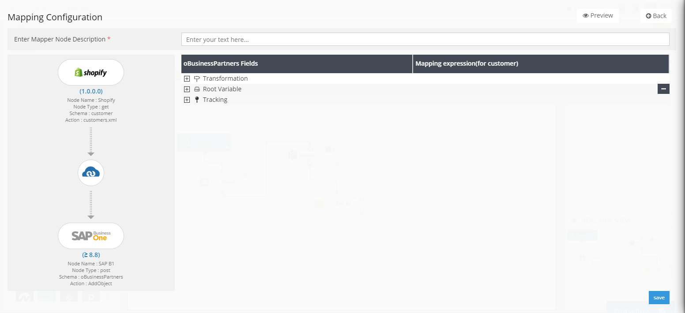
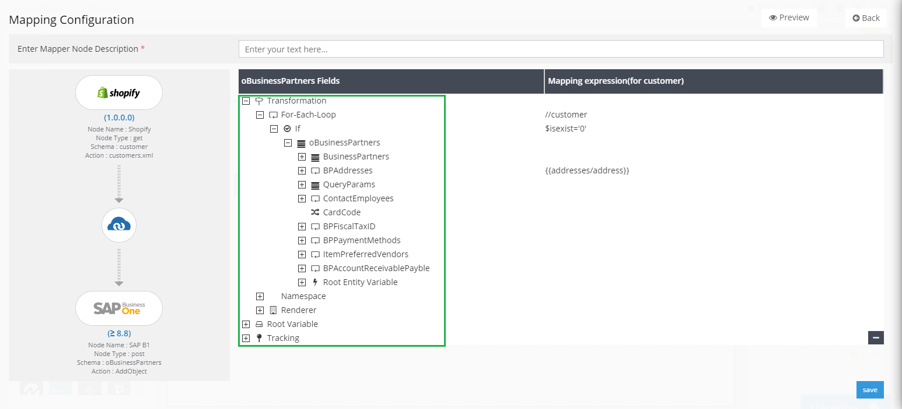

When working with Process Flows, it is essential to map the attributes and the entities of both source and destination applications, for synchronizing data.
Process flow [designer inteface](/processflow/designer-processflow/) gives you the space to design your business flow
and do the node configurations of the applications and trasformation activities all in one go
 
In Process Flows, you need to drag the mapper node and link up the application nodes for activating the Node Configuration window 
of the Mapper Node, as shown in [process flow creation](/processflow/creating-processflow/) section

## Prerequisites for working with Mapper Node
* You should have valid credentials to the portal.
* [Design](/processflow/designer-processflow/) a process flow or need or do mapping on the existing process flow.
* Link both Source and the Destination application with the Mapper Node 
  for activating the Node Configuration window of Mapper Node.

## Steps to work with Mapper Node

1)	Login to the Portal and Navigate to the Process Flow Section from [Process Flow Listing Page](/processflow/processflow-listing-page/).        

2)	[Create a New Process Flow](/processflow/creating-processflow/) or Edit an existing Process Flow in the [Designer Page](/processflow/designer-processflow/).      

3)  Start with linking  the Source and Destination app with the mapper node.The Node configuration Window of Mapper Node opens.
    

4) In the Node Configuration Window of Mapper Node, you will be to view the following components. [structure of the mapper](/transformation/getting-started-with-mapping/#structure-of-mapping)node. The Window will 

- Node Name & Type: You will be able to view the Application Node Name and its Operation Type for both the Source and Destination Application.
- Schema and Action Details: On the Left Pane of the window, you will be displayed with the Schema and Action selected for this transformation process. The details will be shown for both the selected apps.
- Mapper Node Description: This will allow you to provide a description to the mapper node for distinguishing if you are working with multiple mapper nodes in a single Process Flow.
- [structure of the mapper](/transformation/getting-started-with-mapping/#structure-of-mapping)node: The right side of the window, will enlist the components of the mapper node that will help you transform data between applications.

**Note: The option for Lookups in [Structure of Mapping](/transformation/getting-started-with-mapping/#structure-of-mapping) will not be available for ProcessFlows**

5)	[Structure of Mapping](/transformation/getting-started-with-mapping/#structure-of-mapping)will help you know provide a 
basic walkthrough of the Mapper Node. 

**Note: The option for Lookups in [Structure of Mapping](/transformation/getting-started-with-mapping/#structure-of-mapping) will not be available for ProcessFlows**

6) To work with Mapper node, you need to know about the [components of Mapping](/transformation/understanding-components-of-mapping/) or Mapper node. 
  

7)	Variables are one such component which are necessary when working with 
Mapper Node. To know more, view [types of variables](/transformation/types-of-variable/) used in APPSeCONNECT.

8)	Mapper node focuses on mapping of attributes with Source & Destination
applications. To know more, view [steps to Customize Attribute Mapping](/processflow/customising-attribute-mapping/)  

9)	Mapping/Mapper of Processflows requires the usage of Library functions for transforming data from Source to Destination.   
To know more, view the [Appresource functions](/transformation/using-library-methods/).  

10)	You can also implement logic over attributes using IF condition.   
To know more, view [implementing IF condition](/processflow/steps-to-define-logic-over-destination-mapping/) in attribute mapping.  

11) Lookups maps specific value that are required to transform.   
To know more on repository, view [Lookup Repositories](/processflow/implementing-lookup-in-mapping/).  

**Note: The option for Lookups in [Structure of Mapping](/transformation/getting-started-with-mapping/#structure-of-mapping) will not be available for ProcessFlows**

Following are the steps and necessary links that are required to work with the Mapper node of Process Flow.
For executing a sync process user needs to execute the following tasks in mapper node.

* Providing Xpath in For Each loop 
* Creating & Mapping Root Variables and Root Entity Variable for fetching complex values.
* Defining Namespaces
* Mapping Attributes
* Implementing If Condition in various level - Attribute Level, Complex Object Level, Complex Object Collection Level. 

 
