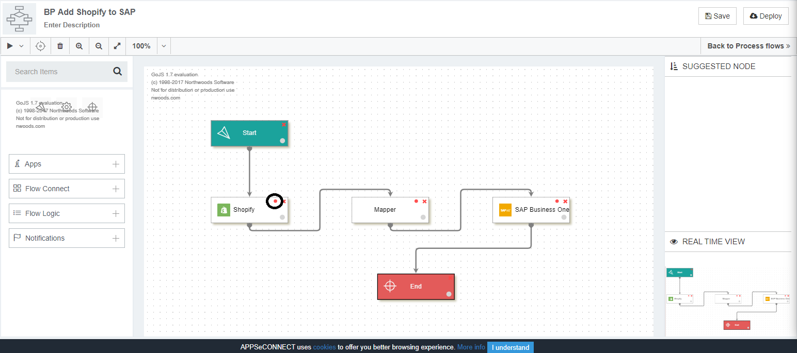
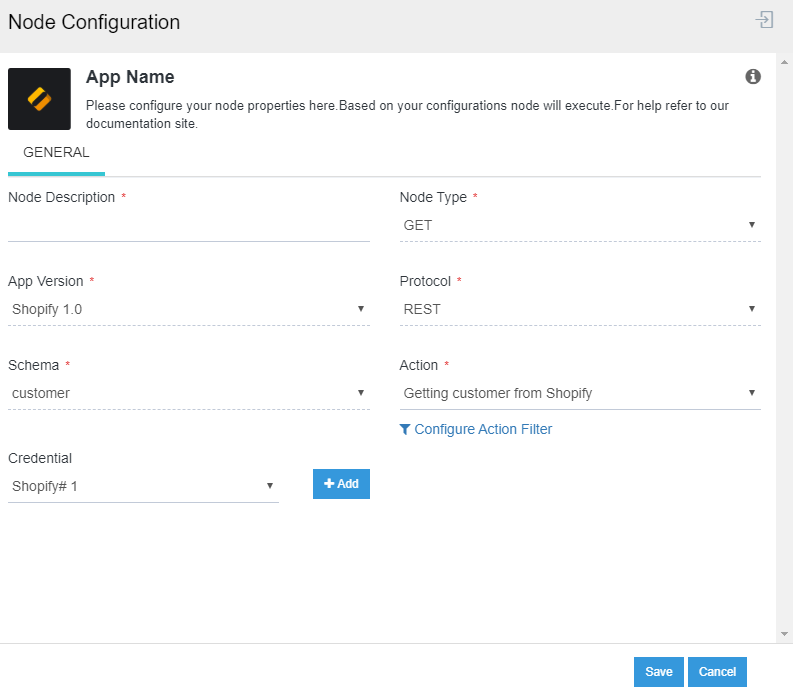

## What is Get Node?

GET node is used for getting data from an application by using their API Endpoints provided by the application. When you drag an application node in the processflow Designer Panel, the node configuration window opens. You specify the following details and click on the SAVE button.
* Node Description: This denotes the description of the node.
* Node Type: This denotes the type of action that the node needs to perform GET or POST.
* App Version: This denotes the version of the Application. You need to select the version of the application you need for the integration.
* Protocol: The protocols would be listed for the application that is selected. 
* Schema: The schemas for the selected application and protocol would be listed in the drop-down. 
* Action: All the action based on the selected schema would be available. You can also modify Action filters by clicking on the Configure Action Filter button. Click here to know more about working with Action Filter.
* Credential: You need to click the button Add, beside Credential to add token in the list. Select the Credential Token added for storing the credential provided for the application in the OP Agent.

For making the application node execute GET operation, you need to select the 
Node Type as `GET`.

## Working Principle for GET node

1. GET node in APPSeCONNECT processflow is linked with the Start node such that when the processflow execution is triggered, the GET node is executed first which fetches data from the source application for the transformation process.
2. Click on the Node Configuration icon to open the Node configuration window for the selected application node.
  
3. Select the node type as GET in the Node Configuration window and click the save button.
   
