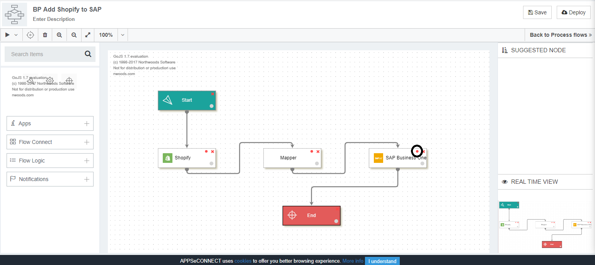
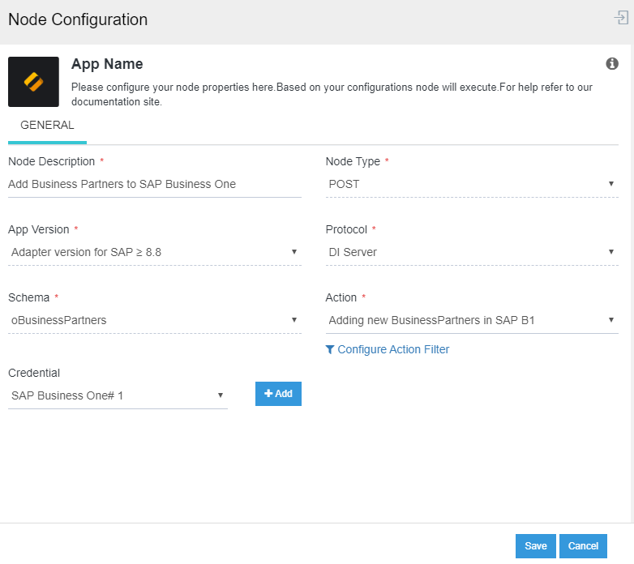

## What is POST Node?

POST node is used for pushing transformed data to the destination application by 
using API Endpoints provided by the application. When you drag an application node 
in the processflow Designer Panel, the node configuration window opens. 
You specify the following details and click on the SAVE button.

* Node Description: This denotes the description of the node.
* Node Type: This denotes the type of action that the node needs to perform GET or POST.
* App Version: This denotes the version of the Application. You need to select the version of the application you need for the integration.
* Protocol: The protocols would be listed for the application that is selected. 
* Schema: The schemas for the selected application and protocol would be listed in the drop-down. 
* Action: All the action based on the selected schema would be available. You can also modify Action filters by clicking on the Configure Action Filter button. Click here to know more about working with Action Filter.
* Credential: You need to click the button Add, beside Credential to add token in the list. Select the Credential Token added for storing the credential provided for the application in the OP Agent.

For making the application node execute POST operation, you need to select the Node Type as POST.

## Working Principle for POST node
1. POST node in APPSeCONNECT processflow is linked with the Mapper node such that when the POST node is executed, the transformed data are pushed to the destination application.
2. Click on the Node Configuration icon to open the Node configuration window for the selected application node.
   
3. Select the node type as POST in the Node Configuration window and click the save button.
   

