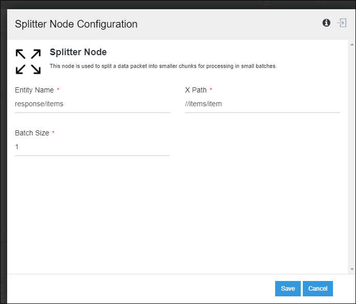
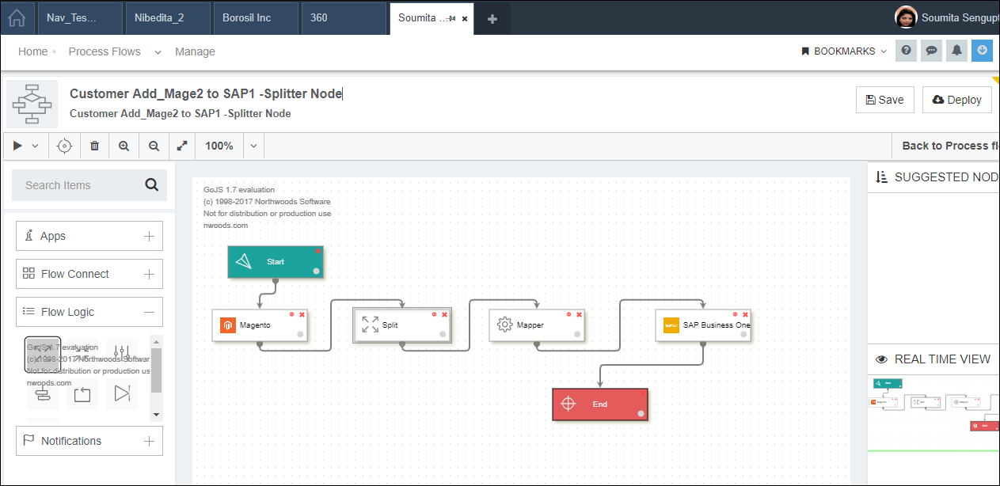

### What is Splitter Node?

This node is used to split a data packet into smaller chunks for processing in small batches. There are three components in a splitter node of a processflow
as shown below. 

**BatchSize**: Here you need to specify the number  of data to be present in each splitted data of the output file of the spiltter node.
For example, suppose you have a data packet which contains 10 customer data and you applied a splitter 
with 2 batch size, so after execution of the splitter node the data packet will be split into 5 data 
packets where each packet contains two customer data and smaller packets will be sent to the next node
for processing.   
**Entityname**: Here specify the name which will act as a root element to append the splitted data.  
 **XPath** : Here user need to specify a XPath based on which data will be splitted.  

### Working Principle

`SPLITTER` node in APPSeCONNECT processflow is used for splitting large volume of data received as input files and 
breaking them into  smaller chunks go to the next process of transformation in the processflow .

For example: if a packet contains 20 customer data. A batch size of 1 is defined in the splitter node,where XPATH  is  //items/item and Entity name as response/items. 
So, after data passed through the Splitter node 20 individual XML data files will be created as output file where each file contains a single customer data.

`For providing the properties of Split and Merger, XPath for the packets is needed to be known.` 

The Parent node for the items present in the XSLT is the `XPATH` that needs to be given in the Split and Merger Property.

**Note: Single forward Slash (For Eg: /Items) access all the sub nodes present inside it. 
Double Forward Slash (For Eg: //Items) access all the nodes present inside it**

The XPath provided also depends on the packets. If the Split Node is attached before the mapper node the xpath needs to provided 
viewing the INPUT Packet and if the split node is attached after the mapper node the XPath is needed to be provided
viewing the Transform Packet.

The Entity field is the Parent nodes of the packet that would be split. The XPath are the child nodes of the Entity.

[PLACEHOLDER]

The XPath provided for the node SPLIT (Magento2 to SAP B1) is shown below:

**Protip:** The ENTITY and the XPATH is different for the INPUT Packet, TRANSFORM Packet, OUTPUT Packet and for 
different Application.
{: .notice--info}