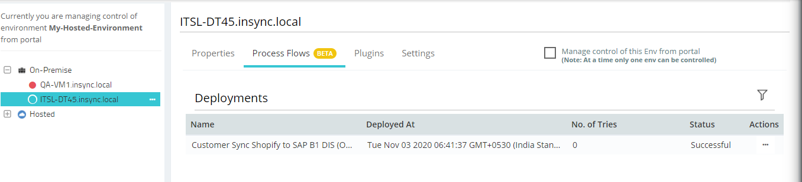
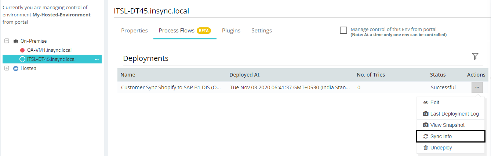
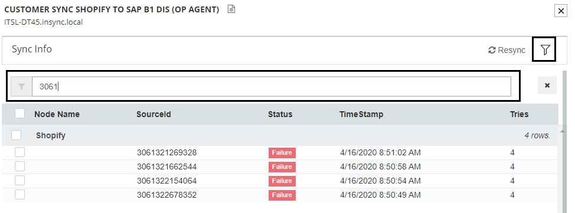
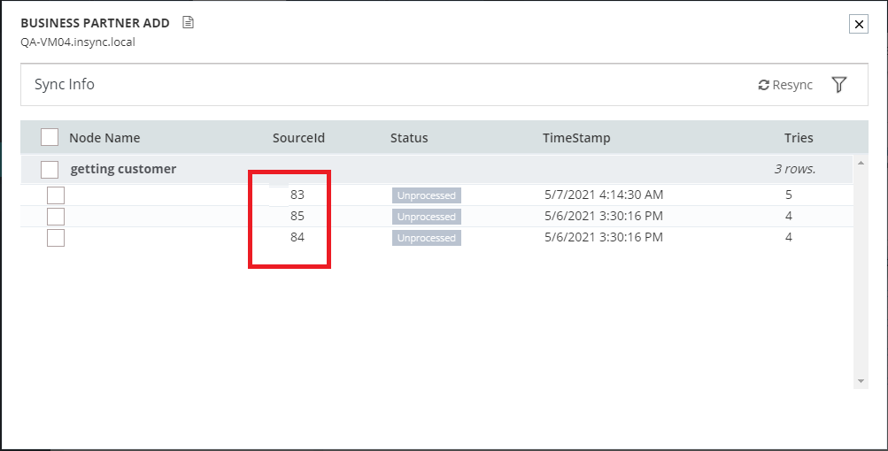

Execution of a processflow is vital process for transforming data from source to 
destination application. In real-time, execution of processflow may fetch errors 
with respect to data configurations. 
Processflow Retry is a feature that can Resync the data after rectifying the error 
such that no data loss occurs with respect to the sync process. ProcessFlow Retry 
can be configured both Manually and in Auto-Mode.

## Prerequisites for processflow Retry (in Auto-Mode)
* You need to [create a processflow](/processflow/creating-processflow/).   
* You need to [deploy](/processflow/deploying-and-executing-processfloww/) the created processflow or an existing process that needs to be executed. 
* [Environment](/deployment/Environment-Management/) should be active for the processflow to execute successfully.
* You need to execute a processflow for implementing Retry. 

### Configuring Auto-Retry:
1.	Navigate to the processflow designer page and Deploy/Redeploy a processflow.    
2.	Click on the `Deploy button` in the designer page. The [deploy](/processflow/deploying-and-executing-processfloww/) wizard opens.    
3.	Configure the settings for deploying the processflow and navigate to the `Sync & Retry` section of deploy wizard.     
      
4.	By default, the `Retry toggle button` will be in` manual mode` when deploying for the first time. Switch the `toggle button` to the `auto mode` to view the configurational panel of Auto Retry.  
      
5.	You need to select the frequency of the autosync from the drop-down. You can setup the configuration as per the following options.  
* Every Day  
* Hour     
      
6.	On keeping the frequency in `Every Day`, you get the option for providing Retry Daily At. You can configure the resync schedule timing by clicking on the Clock Icon beside the Retry Daily at Field. 
      
7.	On selecting the Frequency either as `Everyday or Hourly`, you get these Following common fields.      
(a) Interval: This determines the pause time or break time of the Retry Activity. The interval is hourly basis, if selected 2 , the Interval time of fetching retry data will be of 2hrs.     
    Interval time can be selected from 1-23 only.    
(b) Time Lapse: This determines the execution time of the set of errored data and will execute the Retry based on its previous attempts. The time lapse is based on Minutes.      
(c) Batch Size: This defines the number of data  that will be Resynced in one batch.    
For an Instance: If a set of data is failed at 14:00 hrs, and the Time lapse selected as 20mins. The failed data will be activated for retry after 14:20 hrs. And if the Interval is set at 1hr, the execution of the Retry sync of those failed data happen at 15:00 hrs, if the Deployment Time and the first execution was made at 14:00 hrs.      
8.	After configuring the Auto-Retry, click on the **FINISH** button. Execute the designed processflow.
 **You can execute the processflow both in Manual or in Auto-Mode even if processflow Retry is configured as Auto.**

### Sync Info & Retry
1.	Navigate to the Deploy > Environment for viewing the Sync Info for Retrying, the executed processflow. 

2.	Click on **ProcessFlows** Tab. You can view the list of all the deployed processflows. Following are the details that will display for each deployed processflows.
* ProcessFlow Name  
* Deployed At   
* Snapshots
* No. of Tries
* Deployment Status
* Actions
 

3.	Click Ellipses button (...) available beside the processflow that you have executed. You can view the **SyncInfo** button available in the context menu.  
    

4.	The Sync Info Window that will capture all the data that have synced successfully or have faced errors. You can view the following details in the Sync Info Window:
- Name: You will be able to view the name of the processflow in the Header Panel.
- Environment Name: You will be able to view the Environment Name, on which the PF is deployed.
- Description: You can also view the description of the processflow.
- Resync Button: You can manually Resync the failed data by selecting the record and clickin on the Resync Button.
- Filter Button: You can also filter the failed records by click on the Filter icon.
    

5.	You can view the list of the data along with the following set of informations.
* Node Name: You will be viewing the app name used in the GET node.
* Source Id : The Ids of the failed item fetched from the Source App will be displayed in this Column.
* Status: The status of the all the data failure/Success will be displayed in the bucket.
* Time Stamp: You will be viewing the time stamp of the last execution.
* Tries: You would be viewing number of tries that has been attempted to resync a failed data. 
    
 
6. Sync Info Window will display following sync status: 
- **Success** 
- **Failed** 
- **Unprocessed**. 

7.	You can filter the data in the list using the contents of the Source ID by click on the filter icon.
 

8. You will get a link of Snapshots inside the Sync Info window such that when you click on the row, it will open a filtered view.

9. Once you click on the link, you will be redirected to the snapshots corresponding to the execution of that particular data. 

**Note:**

- For Auto-Retry, each data will be Retried 4 times excluding the main execution.
- You need have the environment active for viewing the details page, You can troubleshoot a [detached or a disconnected agent](/deployment/Environment-Management/#detaching-and-attaching-environment).
- You can anytime Resync the `Failed` and the `Unprocessed` data.

### Manual Retry

1. You can anytime Resync the **Failed & Unprocessed** data manually, after auto-retry has made its attempts, 

2. Select the check boxes and click on the **RESYNC** button. 

**Note:** You can either select all the data by enabling the checkbox beside `Node Name` or you can individually select checkbox, for executing the Resync Process of selective data. 

    

Following the above process, you can successfully implement Auto-Retry and view the data in the Resync Bucket of the Auto-Retry window.

**Protip**  For every Retry process (Both Auto/Manual), you will be generated with a 
[Snapshot](/processflow/snapshot-processflow/)
{: .notice--info} 

## Snapshot view for Retried Data:

The SyncInfo window captures all the data that either is synced successfully, or failed or is in Unprocessed State. However, SyncInfo
window is now featured to display [Snapshot](/processflow/snapshot-processflow/) for every individual data. Below are the steps provided to view individual snapshots for each data.

1) Navigate to Deploy > Environments for accessing the [SyncInfo](/processflow/retry-processflow/#sync-info--retry) window.  

2) You will be listed with all your data that was executed previously.

3) Click on the Hyperlink against the `Sourceids` provided against each data captured.

4) You will get the all the snapshots for the selected data displaying all the execution instances.

Following the above process you can successfully view the snapshots of the retried data.
