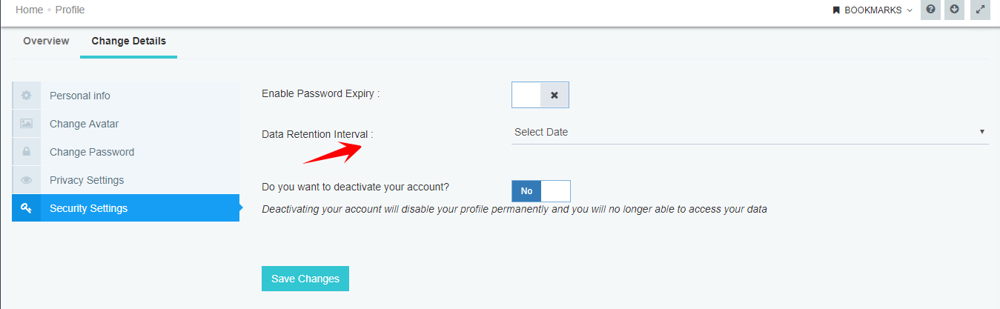

The list of GDPR (Global Data Protection Regulations) policies is given below which  our product imparts to the user
for security of data regulations.

## Data Retention Policy

* Data retention policy will allow configuring the account retention policy of the organization.   
* Data stored by the client will abide by the retention policy.    
 
* You have to go to the Security Settings of the profile and select the Date for data retention policy.
* By default, no option will be selected.   
The user will be allowed to store data for:-   
    1.One Month  
    2.Two Month  
    3.Three Month  

Data will be retained in the resync bucket as per the date selected by the user.
## Password Expiry Policy

User can select whether his/her password of the organization would be expired after some days or not. 

If the user enables Password Expiry toggle button, there three options will be given:
* One Month
* Two Months
* Three Months

These options, simply refer to the time after which the user has to reset his/her project log in password.
When the password expires, the user will be prompted with a new pop up where old password has to be given and new password has to be confirmed.

The user will be notified about the change of password via e-mail.

**Note: User can also choose not to enable the password expiry option, in that case no option in the dropdown will be there.**

## Two Factor Authentication

* When SMS token is provided, there should be a checkbox which will allow the user to save the browser as safe. When the checkbox is picked, the browser will be remembered using a cookie in the browser such that for next 1 month the machine will not ask the two factor authentication again.
* When SMS is sent once, there should be a resend button which should come only after 1 minute. After 3 attempts, only call should be enabled.
* You can do the verification by phone call, SMS or e-mail.

## Download Sensitive Information of User Profile

As per GDPR norms, you can download sensitive information on your profile, like Username, Email Id & Phone no.

* Click on the extreme right corner of your profile i.e. your name and choose My Profile.
* Choose Download My Profile Data button.
* All your sensitive data will be downloaded in a Zip folder.
* If you have Profile picture, that will be downloaded in .jpg/.jpeg format.
* Your name, email id and phone no (including country code) will be downloaded in a .txt file.

## Request for Deactivation of a Project

APPSeCONNECT users will be able to access the profile settings so that they can request for deactivation of their project from my profile section.
* Users should follow the path: My Profile -> Change Details -> Security Settings -> Deactivate Profile (Choose Yes, if you wish to deactivate from the toggle button)
  
* An email will be sent to retention team once a user chooses to deactivate the project/account.

* If an account or project is deactivated, the user cannot log in in the conventional method. While Login user will be asked to contact support@appseconect.com for retrieval.

  

For the support team, Manage Project section will have a specific button to recover the deactivated account.

**Note: Sync operation will continue to run even though a project is deactivated. 
A deleted project or account can only be retrieved from the database, not from 
the manage project section.**

## Log Entry for Each Login in the Portal

Log entry for each login of the user will be stored in APPSeCONNECT, The time stamp and IP Address will be captured.

This means each time you will log into your account, that will reflect on the feeds page of the project as well as in the profile feed section.
The log will consist of the IP address of your system.

## User Activation

If a user cannot access the temporary password sent by APPSeCONNECT, for any reason, and Organization admin or
any person resend activation link, the user will get only activation link. As the product APPSeCONNECT is GDPR
complaint, password is not stored. So, to log in the user has to choose the forgot password section.

