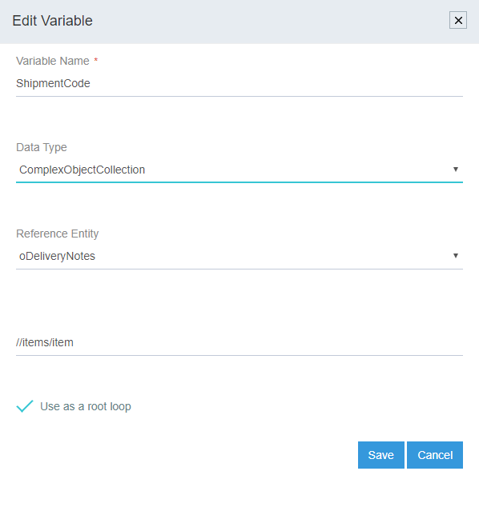
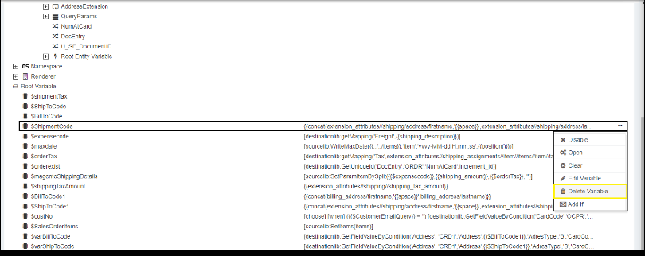
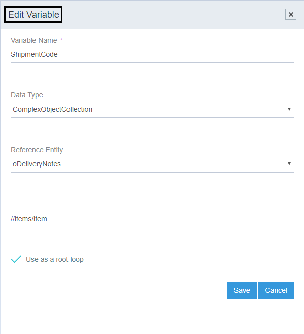

Here you will understand the process of defining [Variables](/transformation/types-of-variable/) (any variables that stores the data that can be used later within 
the process of transformation) and then mapping of variables during transformation phase. 

Here, the flow is explained using `Root Variable` for a Touchpoint.   
**NOTE- The process of defining the variables remain same for any type of variable.**

## Prerequisites

Organisation Creation, Connection Creation & Touchpoint Creation

1.	Login to the APPSeCONNECT Portal and Navigate to the Touchpoint area for the connection you have created.
2.	Select the touchpoint/workflow for which the Root Variable is to be created. And click on the Transform Button.
3.	Click on the Option `ADD VARIABLE` present on the Transform Window.

4.  Input the details Variable Name, Data Type and the Reference Entity.               
        
(a) In this case Variable Name `ShipmentCode` is used whose Data Type is provided `String`. The flow remains same for the 
Data type-  Bool, Datetime, Number and Double.

 (b) Whereas for the `Data Type - Complex Object, Complex Object Collection and Double` providing the XPATH is mandatory as
shown below  
  
Once the details are filled, click on Save and Close. 
For Mapping the variable, click on the Open button, which is visible beside the variable name, when hovered over.
Select the function from the `Functions List`  and click on the function as required (Taken [genericlib:getMapping(ObjectType,Value)] as an example)    
**Note: The mapping can be executed with the functions as well as, with the source attributes. Implementing mapping only with the functions is not mandatory.**
   Now for implementing the mapping, input the required ObjectType and Value in the Function syntax. Click on the Submit Button, on completion of mapping.
   

The user can view the successful sync of the touchpoint for which the Variables was created
Similarly the user can view the error logs in the RESYNC Bucket of the agent (Cloud and OP), if the touchpoint fails to sync for any cases.

## Delete variable
The user can delete the Variables whenever required, any-time after its creation by clicking on `delete variable`.
button. Hardcorded variables cant be deleted.  

## Edit Variable

The user can edit the variables defined any-time after its creation by clicking on `edit variable` button.
Hardcorded variables cant be edited.  

