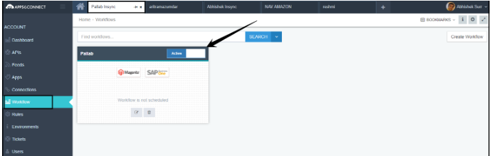
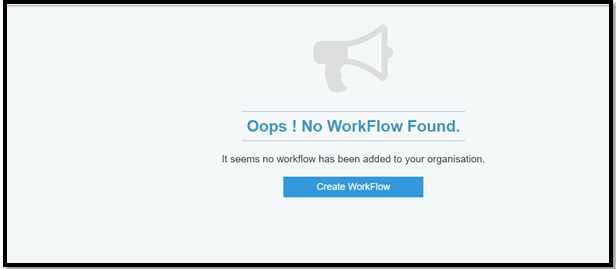
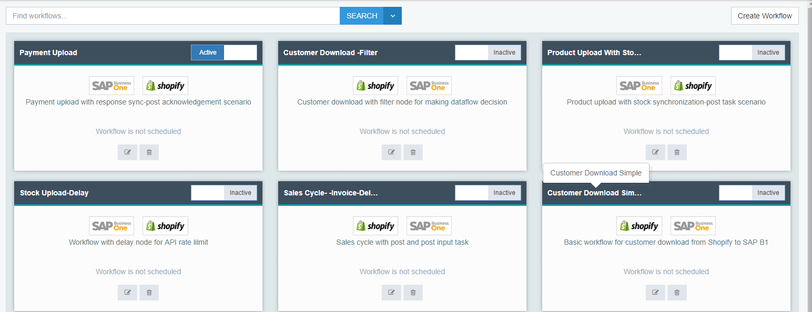
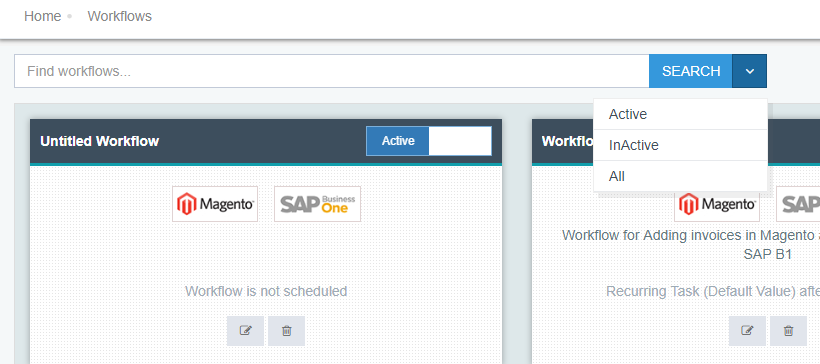

Workflow is group of instructions to the integration service in APPSeCONNECT. 

APPSeCONNECT workflow application can be considered as a strong feature that uses the software to either partially or entirely automate a complex business process. Workflow is  a concept that describes how process in business divides work activities into distinct *roles, task, procedures and rules*.

The Workflow feature helps user to graphically organize, create and view the data flow of a process.The customers with the aid of workflow can now design integration anytime and anywhere with the help of cloud portal.

Workflow enables to execute the orchestrated pattern of business activity with efficiency and optimality.

**Benefits of Using Workflow**

1. Visibilty & Status Check of Business Scenario
2. Eliminates Manual work & reduces human error
3. Enables quick decision making & Learn from inefficiencies
4. Maintain & Improve Quality
5. Modifying Step Order
6. Real time Reports

**Elements/Nodes of Workflow**

* Get
* Process
* Post
* Halt- Resume
* Delay

(Create Link to the Nodes details page)

**Actions of Workflow**
* Email
* Ticket
* Webhook
* Storage

**Process Property of Workflow**

* Split
* Merger
* Rule
* Sequencer
* Touchpoint

**Templates of Workflow**

* General Touchpoint
* Post Touchpoint
* Get Merge Touchpoint
* Push Merge Touchpoint
* Get Splitted Touchpoint
* Push Splitted Touchpoint

### Working with Workflow in APPSeCONNECT

 APPSeCONNECT Workflows are the diagrammatic representations of a business process.  

 Organizations use Workflows to coordinate tasks and synchronize data between systems, with the ultimate goal of improving organizational efficiency, responsiveness and ease of use.

 The workflow management screen will allow to search, filter, create and edit workflows.

 An implementer can ensure that all the projects are listed on a single page showing its various status and allowing to change status by reading this document.

 1. Log in to the APPSeCONNECT Portal
 2. Now choose a `Project -> Workflows` section under Account and a new page will open.

  

 **Protip** Choose Project only, if you have multiple projects, else directly you are into your project

 3. If you are a new user and no previous workflow is there, neither in Base nor in the user template, this screen will appear

 4.  If you are an existing user who have used Workflows, the following screen will appear

 5. You can view maximum of 6 workflow designed in a workflow page, rest workflows can be scrolled through navigation pages.

 6. APPSeCONNECT has two category of Workflows: 

     **Organization Workflow** -  This type of Workflow have two button `Edit` & `Delete`and you have to activate it.    

    **Base Workflow** - This type of workflow has initially one button. Once you activate it, you will see that Workflow contains two buttons, one for Edit, another for Delete.  
 
 7. Every workflow has one switch, this will either take the  workflow to `Active state` or will go to `Inactive state`. If it's in Inactive state, that workflow will not work on Agent's App.

     

 8. You will get `SEARCH` panel in the top of the workflow page.

      

There are three types of Search functions you can use,e.g. 
* Active - indicates that you want to search only for the active Workflows.
* Inactive - indicates that you want to search only for the active Workflows.
* All - indicates that you can search for every Workflow listed under your project.

**Protip** The search will work with `all types characters like special, alphanumeric`. `Partial search` also will happen. There is no need to combine the search and dropdown in the Search section. 

If you type nothing and click on Search, all the Workflows listed under your project will show on the page.

The above points explains the basic Workflow management in the portal.

Detailed decription of workflow creation & execution is given in the subsequent sections.
 
