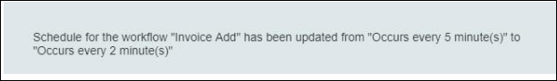

Workflow in APPSeCONNECT provides integration solution which helps any business to execute
integration flow of data between two or more applications. With APPSeCONNECT, you can deploy, 
execute and maintain business integrations. In this article we will see how you can use workflow
runtime to debug and execute workflows.

## Prerequisites
* You must choose the project in which the user will be added.
* Install the AEC OP Agent from the portal and login with the portal credentials. [Click here](/deployment/Deployment-Configuration/) to know more about the agent setup and configuration.
* Now Choose any two application for integration & [workflow creation](/workflow/steps-to-create-your-first-workflow/).
* Before executing the workflow for app integration, you should have a valid data in the source application
* The connection or the workflow design should be done in the Cloud Portal.
* The environment should be set as **PRIMARY** by enabling the checkbox beside the [Environment](/deployment/Environment-Management/#accessing-the-environment-user-interface) name. The workflow will be deployed only to the environment which will be set as primary.

## Creating a Workflow

[Click here](/workflow/steps-to-create-your-first-workflow/) to know more about creating or designing a workflow. The user can also select the workflow, from the [Choose workflow](/workflow/steps-to-choose-your-workflow/) button. 

## Scheduling a Workflow

1.	Navigate to the workflow design area and click on the Schedule button.
 
2.	The schedule window shows up. The windows have the following fields as displayed below:
   
a.	Sync type: This depicts whether the process is Auto or Manual.    
b.	Repeat: This has three option in the drop-down Every Minute, Daily & Hourly.    
c.	Repeat Interval: This determines the time gap between the sync processes.     
d.	End: This field has two options.   
* Never: If selected, the process will be an infinite loop until stopped.
* End after a defined repetition: When selected this option, an additional field appears "End After" which
  depicts the End Time Occurrence.
3.	After Scheduling the workflow, click OK button.

**Protip:** Whenever you schedule a workflow a message will get updated in the feeds after scheduling the time interval of workflow form the OP Agent.
 {: .notice--info}

## Publishing a Workflow

If you change attribute mapping in a workflow you need to publish the workflow before deploying. The steps to do the same
is given below

1.	After creating and saving the workflow, click `Reset Generate` Button followed by `Reset Publish`button.

2. The Actions column on the right side of screen consist of buttons that configures and publish the touchpoint used in the workflow.

a. Preview - This button previews the XSLT for the touchpoint used in the workflow.  
b. Reset Publish - This button publishes the configuration of the touchpoint that is used in the workflow.  
c. Reset Generate - This button generates the configuration for the touchpoint. After generating the configuration, the `Reset Publish` is done.  
d. Resync Bucket - APPSeCONNECT uses Resync Bucket to keep track of all the items that are getting synced. The portal view for the Resync Bucket is given below.  

* You will get the view of all data synced - Success, Failed, Unprocessed.
* Now to resync the failed data, select one data or more and click on `Resync` button.
* You can view the resync execution status as message/progress bar below the pop up window.

3. On refreshing, the Publish button appears. The Publish button `publishes every configuration that  the 
user made in the APPSeCONNECT cloud` and is `compiled to a single file stored on the server` which is 
accessible from the APPSeCONNECT Agent.
 

## Deploying a Workflow

The procedures for deploying workflow as per the chosen environment is given below:

### Deploying in OP Agent

1) After successfully [publishing](/workflow/deploying-and-executing/#publishing-a-workflow) the workflow, you need to click on the **Update Configuration** button, to deploy the changes in the OP AGENT. As a prerequisite, the required environment needs to be set as primary from the [environment](/deployment/Environment-Management/) section.

2) Once the configuration are updated, you can view your workflow deployed in the [Workflow Panel](/deployment/Deployment-Configuration/#configuration-process-for-op)

**Note:** Before Updating Configuration, you need to uncheck the Enable Environment button.

### Deploying in Cloud Agent

After successfully publishing the workflow, you need run and execute the workflow. As a prerequisite, you need to enable the Cloud Environment as primary by checking the checkbox in the [environment section](/deployment/Environment-Management/) before [publishing](/workflow/deploying-and-executing/#publishing-a-workflow) the workflow.

## Executing the Workflow

1. Start workflow and navigate to Workflow.      
2. Open the workflow you want to execute or debug.When you open the workflow screen, you will be first
ported in edit mode.       
3. Click on Play button to execute a workflow.         
      
4. When you play a workflow, you will be able to see each step of the operation. The nodes will be automatically highlighted during execution of the work.
 - Operation is going on = yellow color
 - Operation successfully executed = green color
 - Operation failed = red color  

5. After execution of workflow is complete, you can check each and every step of the workflow that is being executed on the platform.  
6. The complete execution process of the workflow can be viewed through the [process snapshot](/workflow/list-of-snapshot/).

This ends the process of scheduling workflows.

**Protip:** Make sure the environment you have configured for the application is running correctly. 
 {: .notice--info}
