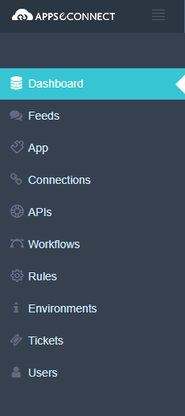
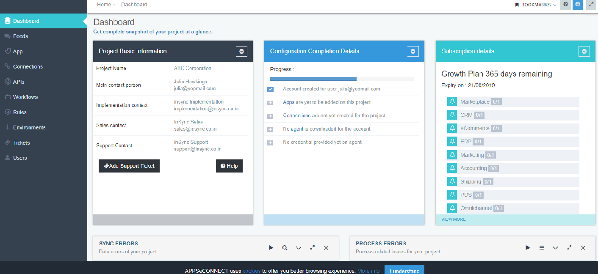
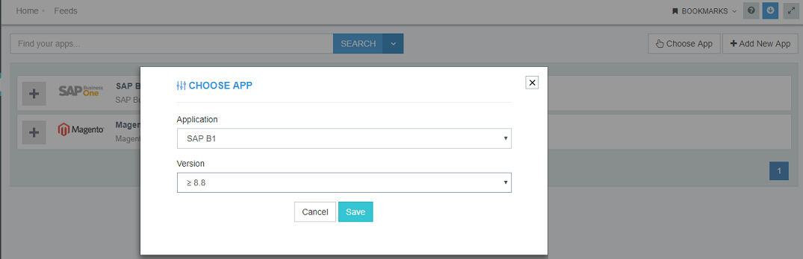
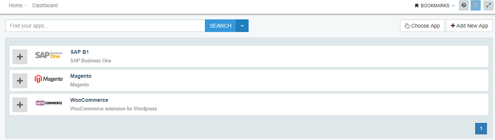
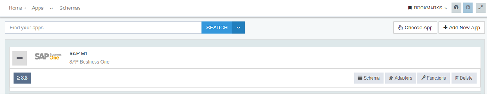
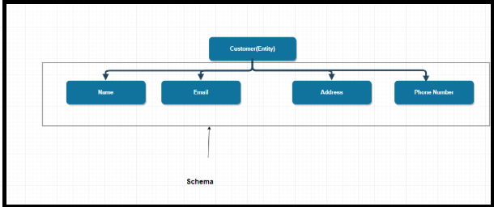
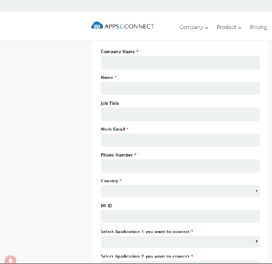

---
title: "Overview of AppseConnect"
toc: true
tag: developers
category: "AppseConnect & IPAAS"
---

APPSeCONNECT is a cloud-based hybrid solution which maps business processes of ERP with eCommerce / Marketplaces or CRM Systems. It is called a hybrid solution because the platform gives a readymade end-to-end service which can be re-configured and downloaded from the APPSeCONNECT 'cloud'  while all the credentials remain intact in the system's own premises. 
APPSeCONNECT is developed as a platform where an ISV partner can also work together with APPSeCONNECT and develop the cloud configurations for the Apps which it does not support and can work seamlessly together with Apps which it does. APPSeCONNECT installs an Agent on the system's own premises, which downloads all the configurations from cloud to use them for synchronization operations done on-premise. 

iness function perspective. The goal of the User Manual is to give a detailed overview of all the features of the product along with a proper description of the components.

# Introduction to IPAAS

Integration Platform as a Service (IPPAS) is a group of cloud services which enables to execute and control the integration flows via on premises and cloud-based processes, applications and data within individual or across multiple organizations.
In IPPAS the third-party provider provides infrastructure and middleware to manage the data integration on premises and cloud-based processes.
Generally, data integration happens between:

Cloud to Cloud Applications: For e.g Salesforce and Shopify
Cloud to On-Premise / On-Premise to On-Premise Applications (Hybrid): For e.g Salesforce and SAP Business One

# Hybrid Integration Model

Hybrid integration permits on-premises applications to flawlessly integrate with cloud-based applications. Most businesses presently prefer connecting their existing custom and packaged solutions and create a single platform for new services. 
APPSeCONNECT helps enterprises seamlessly connect applications both on-premises and in the cloud, allowing the development of hybrid architecture in which you have control over the data passed between specific applications.  

# Why is Cloud Integration necessary?

* Easily Accessible solution

  - Access business data real time from any device and in any location 

* Totally Flexible Platform

  - Simple browser-based management that requires no additional on premise infrastructure

* Scale up or down more Easily

  - Easy Scaling in terms of app count, user count or both

# APPSeCONNECT as iPaaS

APPSeCONNECT is a smart and robust integration platform (IPAAS) and benefits the end user with incredible features and provide solutions to meet the ever-changing business requirements. 

APPSeCONNECT as IPAAS - Save Time and Effort, Focus on Profitability & Boost Productivity

## Save Time and Effort
Seamlessly connect business-critical applications and save huge amount of time and effort by automating business processes

## Focus on Profitability
Streamlined business processes lets you focus on what matters the most: increasing customer satisfaction, revenue, growth!

## Boost Productivity
Eliminate the need for manual data entry, resulting reduced risk of errors, increased productivity, quality and a happier workforce

A Sneak-Peak to APPSeCONNECT Feature
* Cloud to Cloud integration
* A highly portable Agent Application
* The APPSeCONNECT Integration Workflow Designer
* API-led Connectivity
* Business Rule Engine
* Secure Integration

# APPSeCONNECT Architecture & Usability

APPSeCONNECT is a generic platform which enables users to deploy, run, and succeed in their integration projects. Using APPSeCONNECT, the users can run their integration processes completely in the cloud without the need to procure any software or the set-up required to operate it. 

Those who wish to deploy APPSeCONNECT platform, on-premise mode has the elasticity to run their integration processes by deploying the agent(s) behind the firewall, thereby obtaining greater control on where their data resides.

APPSeCONNECT recognizes that many users need their integration processes to communicate with applications that operate behind corporate firewalls for various security and regulatory compliance reasons.
APPSeCONNECT system architecture accommodates to both scenarios: On cloud integration processes or On Premise behind corporate firewalls to safeguard that corporate data does not get visible to the cloud.

APPSeCONNECT comprises of mainly two components.
* Cloud/Web

* Agent

It is a hybrid solution which can centralize your application(s) communication logic, business logic, and your custom data into configurable endpoints (also called as Touchpoints), which will eventually be downloaded to the APPSeCONNECT thin clients installed on your local server to transform your business data between applications

The server is configured with pre-defined templates which can provide you with a ready-made one-click solution to map basic business requirements with all functional endpoints between apps, while APPSeCONNECT also gives you an option to customize both the pre-defined touchpoints and/or new touchpoints to map your own business processes.

APPSeCONNECT comprises of mainly two components.

* Cloud Implementation
* Hybrid Implementation

# APPSeCONNECT Platform - Functional Menus

The APPSeCONNECT portal is the web-based interface where you can access APPSeCONNECT applications for integration, with the set of Functional menus. The APPSeCONNECT portal is accessible at https://portal.appseconnect.com/.

Once you have logged in, some elements of the APPSeCONNECT portal are common to all apps, accessible via the left side panel of the page. Of note, these also includes accessing your account, where you can update your information as well as changing your password.

The set of functional menus are easy to navigate and ease the method of imtegration via our Portal.
The view of functional menu(s) is given below:

Let us walkthrough the Functional Menu for understanding the usage and need of each menu. 

# A. Accessing Organization Dashboard 
Dashboard is the default page which you can view after logging in to the APPSeCONNECT portal. The dashboard can be seen automatically when a Project has been chosen. In this page you can see the snapshot of the project at a glance with respect to the activities of the user. The dashboard view captures the following information- 

1. Basic organization information.

2. Subscription Detail of the user 

3. Sync Errors of last 24 hours showing success sync & failure sync information

3. Support tickets status - Pending/Open tickets.

4. List of today's to-do for that user who has logged in.

5. Shortcut links for variously related menus.

Dashboard View is given below:

Choose any of the dashboard panel and it will redirect you to the related functionality of the menu in details (Link to dashboard detail page).

# B. Feeds

You can see and track all the activities in form of recent feeds directly through the APPSeCONNECT portal after logging into your account. Traces of past activities of the user can be been viewed in the feed section.

1. Choose & Click on a Project.
2. click on **Feeds** menu.
3. Here you can only see your activities in your logged in profile.
4. Feeds Page has search criteria, so that you can filter the feed using topic keyoword filters like "touchpoint", "masterdata" etc.
4. This is view only menu.

**ProTip:** If you are a superadmin, any changes in the organizations done by you will be reflected in your feed section and also in the those organization feed section where changes has been made. 

# C. Choosing App

APPSeCONNECT support large number of apps and you can find and choose the app from the prebuilt list. If you cannot find your App on the list, you might want to try out our App creation page to add a new App to our database. Any App once added is assigned to a particular category. 

The organization-specific app screen page displays all the apps that are present in a specific organization. 

Some of the predefined categories are : 

1. ERP 
2. ECommerce
3. CRM
4. Accounting, etc. 

One has to search for the organization in the search box and the organization will open up. Go to the App menu. Here you will get two option - **Choose App & Add New App**.

## (a) Process of Choosing App 

1. Choose App option enables you to choose app from the list of prebuilt apps on the portal.

2. A dialog box appears where you will choose the application and version number from the drop down list. Click **SAVE** to save the app.

3. The list of app you choose gets added and listed in the app section of the orgnaization as shown below:

4. Each app has four different component attached to it - **Schema, Adapater, Extension, Functions & Delete**.

**APPSeCONNECT Schema/Entity**- An entity is defined as an object that has a real-world existence. An entity can be a single thing, person, place, or object. For an e-commerce website, Customer, Order, Invoice etc are entities.

* Data can be stored about such entities.

* Each schema has its own characteristics or attributes. For example, ‘customer id’, ‘address’, ‘phone number’ are attributes to the ‘customer’ entity. Each customer record in the database serves as an entity item.

* The definition of an entity is called its schema. In other words, the structure of an entity is called its schema.

* If a customer is an entity, then the complete set of the various fields associated with it is called its schema.

Schema Image is given below:

**Adapter**
Adapters helps in integration with other applications easy. Adapter represents an interface between an APP and APPSeCONNECT. An adapter is a component which connects your app with APPSeCONNECT. 

There are few responsibilities of an adapter which are defined as under: 

* Create a credentials view which allows connecting to the respective APP where you want to connect.

* Create Push and Pull method inside the adapter which can send and receive data to and from the application.

* Add additional business behavior with respect to the corresponding app.

The Adapter is loaded dynamically by the **Agent** (create link) and calls some specific methods using a fixed contract defined as an interface. 

**LINK TO ADAPTER DEVELOPMENT**

**Extension**

Extensions, on the other hand, are the applications which add an extra feature into the E-commerce/ERP platforms making them capable to work with the APPSeCONNECT agent. When an app supports extension, it enables customization.

**Functions**

The APPSeCONNECT expression methods are special transformation block used during **mapping** (link). The platform provides a bunch of helper functionalities which can be used during mapping/action filters/rules etc. These functions can either be provided through the platform, or you can write one as an independent Software Vendor. The three different types are as follows:

* Generic
* Native
* Cloud App Resource

**Delete**

This button enables to delete selected app from the list.

**ProTip:** Please choose the category correctly because depending on your choice, you might be allowed to add Connectors. This portal do not support connectors between Apps in the same group (As that won't process any business requirement). For instance, migration jobs from SAP B1 to SAP ECC will not be supported at this time. 

## (B) Configuring App
**LINK WILL BE GIVEN** 

# D. Connections

The Connection Page of the Portal enables creating the connection between two different Applications.  You can also view the existing connection for a particular organization on this page.

# Release Notes/Release Information

**LINK WILL BE GIVEN**

# Trial Version Request - APPSeCONNECT

## Visitor's Free Request Trial

You can request a free trial version of APPSeCONNECT by visting the portal of APPSeCONNECT  and clicking on https://www.appseconnect.com/.

Free Trial (Where we will only showcase the integration on vanilla systems)

1. The Landing page of the APPSeCONNECT Portal gives the option to request for a **FREE TRIAL**.

2. Click the option Free Trial and the following screen appears

 

3. A vistors request form for availing trial version opens up as    shown below. Here the vistor can put their requirement details.

4. The form requires the visitors to fill the basic contact details along with the application(s) selection criteria to choose from and the time required to buy the services.

5. The visitors will complete of form Fill up and click on **Start Free Trial** button given at the end of the form.

6. An automatic email will be send to both the visitors and APPSeCONNECT Consultant regarding the request.

7. Our Consultant will connect back to the vistors and help them with their request for integration within our trial period of 30 days.

## Visitors Paid Request
 
 1. The process of getting paid request trial is similar to free request trial.

 2. Since it is a paid request where we will charge a nominal implementation cost but will implement integration based on Visitors/Customers customization.

# Customer Registration & logging Information  

You must sign up for an account with  APPSeCONNECT Community and be logged in order to access the Support section of the community.

## A. New Customer Logging Information

First, you must sign up for an account with APPSeCONNECT Community.

1. The Implementation Team will do user activation. Click [User Activation](https://appseconnect.freshdesk.com/a/solutions/articles/4000073318) to view the same.

2. You will receive an activation mail in the provided email id with UserId & Password (one time password) details. 

3. Click on the link and the user account gets activated.

4. Now login to the portal with the provided UserId & Password (one time password) details. 

5. You are now logged in to the APPSeCONNECT portal.

6. To change the password, go to [APPSeCONNECT Portal Profile](https://appseconnect.freshdesk.com/a/solutions/articles/4000073318) section and click on **Change Details** to change your password.

**ProTip:** If a user cannot access the '/temporarypassword' sent by APPSeCONNECT, for any reason, and Organization admin or any person resend activation link, the user will get only activation link. As the product APPSeCONNECT is GDPR complaint, password is not stored. So, to log in the user has to choose the forgot password section.
{: .notice--info}

## B. Existing Customer Logging Information

Once registered, make sure you are logged in to the APPSeCONNECT Community to view and manage your support cases.

1. Click on the URL (Insert URL & Link it) and this will take you the login page of  APPSeCONNECT Portal.

2. The login page has a username and password field. Enter the details there

3. Login with your  valid email Id and password. Click on Sign In button

4. You are now logged in to the application.

5. Select the "Remember Me" checkbox in the login page, If you wish the system to remember your login email id
   after logging out from the account.

6. Click the "Forgot Password" option to reset the password. A mail will be sent to your (user) account. You can reset the password by clicking on the link provided in the mail and set up a new password.

