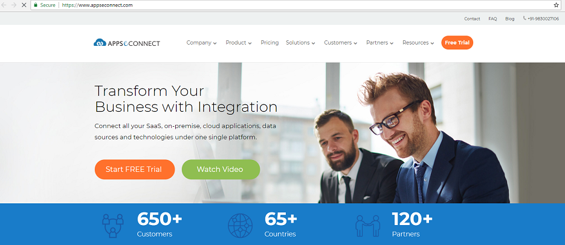
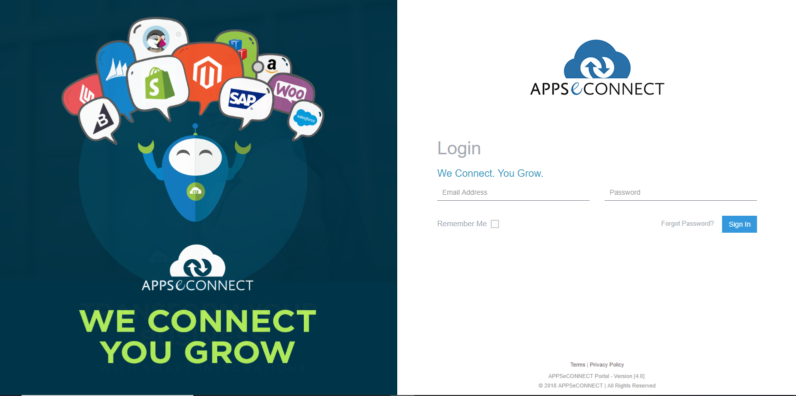
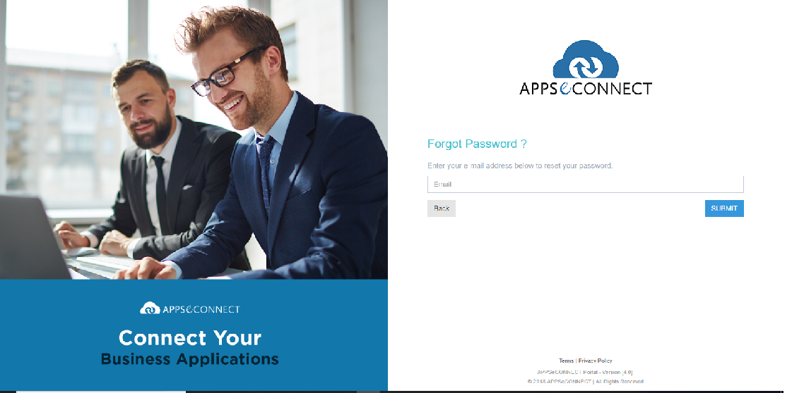

---
title: "Overview of AppseConnect"
toc: true
tag: developers
category: "AppseConnect & IPAAS"
---

APPSeCONNECT is a cloud-based hybrid solution which maps business processes of ERP with eCommerce / Marketplaces or CRM Systems. It is called a hybrid solution because the platform gives a readymade end-to-end service which can be re-configured and downloaded from the APPSeCONNECT 'cloud'  while all the credentials remain intact in the system's own premises. 
APPSeCONNECT is developed as a platform where an ISV partner can also work together with APPSeCONNECT and develop the cloud configurations for the Apps which it does not support and can work seamlessly together with Apps which it does. APPSeCONNECT installs an Agent on the system's own premises, which downloads all the configurations from cloud to use them for synchronization operations done on-premise. 

iness function perspective. The goal of the User Manual is to give a detailed overview of all the features of the product along with a proper description of the components.

# Introduction to IPAAS

Integration Platform as a Service (IPPAS) is a group of cloud services which enables to execute and control the integration flows via on premises and cloud-based processes, applications and data within individual or across multiple organizations.
In IPPAS the third-party provider provides infrastructure and middleware to manage the data integration on premises and cloud-based processes.
Generally, data integration happens between:

Cloud to Cloud Applications: For e.g Salesforce and Shopify
Cloud to On-Premise / On-Premise to On-Premise Applications (Hybrid): For e.g Salesforce and SAP Business One

# Hybrid Integration Model

Hybrid integration permits on-premises applications to flawlessly integrate with cloud-based applications. Most businesses presently prefer connecting their existing custom and packaged solutions and create a single platform for new services. 
APPSeCONNECT helps enterprises seamlessly connect applications both on-premises and in the cloud, allowing the development of hybrid architecture in which you have control over the data passed between specific applications.  

# Why is Cloud Integration necessary?

* Easily Accessible solution

  - Access business data real time from any device and in any location 

* Totally Flexible Platform

  - Simple browser-based management that requires no additional on premise infrastructure

* Scale up or down more Easily

  - Easy Scaling in terms of app count, user count or both

# APPSeCONNECT as iPaaS

APPSeCONNECT is a smart and robust integration platform (IPAAS) and benefits the end user with incredible features and provide solutions to meet the ever-changing business requirements. 

APPSeCONNECT as IPAAS - Save Time and Effort, Focus on Profitability & Boost Productivity

## Save Time and Effort
Seamlessly connect business-critical applications and save huge amount of time and effort by automating business processes

## Focus on Profitability
Streamlined business processes lets you focus on what matters the most: increasing customer satisfaction, revenue, growth!

## Boost Productivity
Eliminate the need for manual data entry, resulting reduced risk of errors, increased productivity, quality and a happier workforce

A Sneak-Peak to APPSeCONNECT Feature
* Cloud to Cloud integration
* A highly portable Agent Application
* The APPSeCONNECT Integration Workflow Designer
* API-led Connectivity
* Business Rule Engine
* Secure Integration

# App se Connect Architecture & Usability

APPSeCONNECT is a generic platform which enables users to deploy, run, and succeed in their integration projects. Using APPSeCONNECT, the users can run their integration processes completely in the cloud without the need to procure any software or the set-up required to operate it. 

Those who wish to deploy APPSeCONNECT platform, on-premise mode has the elasticity to run their integration processes by deploying the agent(s) behind the firewall, thereby obtaining greater control on where their data resides.

APPSeCONNECT recognizes that many users need their integration processes to communicate with applications that operate behind corporate firewalls for various security and regulatory compliance reasons.
APPSeCONNECT system architecture accommodates to both scenarios: On cloud integration processes or On Premise behind corporate firewalls to safeguard that corporate data does not get visible to the cloud.

APPSeCONNECT comprises of mainly two components.
* Cloud/Web

* Agent

It is a hybrid solution which can centralize your application(s) communication logic, business logic, and your custom data into configurable endpoints (also called as Touchpoints), which will eventually be downloaded to the APPSeCONNECT thin clients installed on your local server to transform your business data between applications

The server is configured with pre-defined templates which can provide you with a ready-made one-click solution to map basic business requirements with all functional endpoints between apps, while APPSeCONNECT also gives you an option to customize both the pre-defined touchpoints and/or new touchpoints to map your own business processes.

APPSeCONNECT comprises of mainly two components.

* Cloud Implementation
* Hybrid Implementation

# APPSeCONNECT Platform - Functional Menus

# Release Notes/Release Information

# Trial Version Request

## Visitor's Free Request

You can request a free trial version of APPSeCONNECT by visting the portal of APPSeCONNECT  and clicking on https://www.appseconnect.com/.

1. The Landing page of the APPSeCONNECT Portal gives the option to request for a **FREE TRIAL**.

2. Click the option Free Trial and the following screen appears

 

3. A vistors request form for availing trial version appears 
## Visitors Paid Request

# Customer Registration & logging Information  

You must sign up for an account with  APPSeCONNECT Community and be logged in order to access the Support section of the community.

## A. New Customer Logging Information

First, you must sign up for an account with APPSeCONNECT Community.

1. The Implementation Team will do user activation. Click [User Activation](https://appseconnect.freshdesk.com/a/solutions/articles/4000073318) to view the same.

2. You will receive an activation mail in the provided email id with UserId & Password (one time password)         details. 

3. Click on the link and the user account gets activated.

4. Now login to the portal with the provided UserId & Password (one time password) details. 

5. You are now logged in to the APPSeCONNECT portal.

6. To change the password, go to [APPSeCONNECT Portal Profile](https://appseconnect.freshdesk.com/a/solutions/articles/4000073318) section and click on **Change Details** to change your password.

**ProTip:** If a user cannot access the '/temporarypassword' sent by APPSeCONNECT, for any reason, and Organization admin or any person resend activation link, the user will get only activation link. As the product APPSeCONNECT is GDPR complaint, password is not stored. So, to log in the user has to choose the forgot password section.
{: .notice--info}

## B. Existing Customer Logging Information

Once registered, make sure you are logged in to the APPSeCONNECT Community to view and manage your support cases.

1. Click on the URL (Insert URL & Link it) and this will take you the login page of  APPSeCONNECT Portal.

2. The login page has a username and password field. Enter the details there

3. Login with your  valid email Id and password. Click on Sign In button

4. You are now logged in to the application.

5. Select the "Remember Me" checkbox in the login page, If you wish the system to remember your login email id
   after logging out from the account.

6. Click the "Forgot Password" option to reset the password. A mail will be sent to your (user) account. You can reset the password by clicking on the link provided in the mail and set up a new password.

